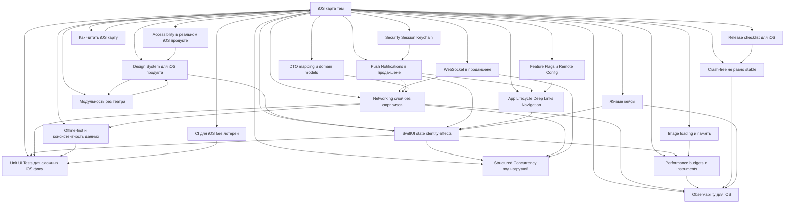

# iOS карта тем

> **Коротко:** Заметки про места, где iOS-код начинает стоить дорого: состояние, сеть, пуши, тесты, дизайн-система, хранение, производительность, навигация и модульность.

## Как этим пользоваться
Сначала [Как читать iOS карту](<Как читать.md>).

Не надо читать сверху вниз. Лучше идти от боли:

- экран дергается, перерисовывается или показывает старые данные → [SwiftUI state identity effects](<../01 SwiftUI и UI/SwiftUI state identity effects.md>)
- UI расползается между командами и фичами → [Design System для iOS продукта](<../01 SwiftUI и UI/Design System для iOS продукта.md>)
- живые события теряются, дублируются или приходят не в тот экран → [WebSocket в продакшене](<../02 Сеть и данные/WebSocket в продакшене.md>)
- пуш открыл приложение, но фича еще не готова принять deep link → [Push Notifications в продакшене](<../03 Push Deep Links и флаги/Push Notifications в продакшене.md>)
- тесты проходят локально и падают на CI → [Unit UI Tests для сложных iOS флоу](<../04 Тесты CI и релиз/Unit UI Tests для сложных iOS флоу.md>)
- задачи переживают экран или отменяются только «на бумаге» → [Structured Concurrency под нагрузкой](<../08 Concurrency/Structured Concurrency под нагрузкой.md>)
- сетевой слой знает слишком много случайных правил → [Networking слой без сюрпризов](<../02 Сеть и данные/Networking слой без сюрпризов.md>)
- deep link теряется на холодном старте → [App Lifecycle Deep Links Navigation](<../03 Push Deep Links и флаги/App Lifecycle Deep Links Navigation.md>)
- кеш быстрый, но непонятно, свежие ли данные → [Offline-first и консистентность данных](<../02 Сеть и данные/Offline-first и консистентность данных.md>)
- экран «иногда тормозит», но никто не мерил → [Performance budgets и Instruments](<../06 Производительность и наблюдаемость/Performance budgets и Instruments.md>)
- продовая жалоба не воспроизводится локально → [Observability для iOS](<../06 Производительность и наблюдаемость/Observability для iOS.md>)
- модулей много, а границ все равно нет → [Модульность без театра](<../05 Архитектура и границы/Модульность без театра.md>)
- backend меняет поля, а UI начинает чинить DTO на месте → [DTO mapping и domain models](<../05 Архитектура и границы/DTO mapping и domain models.md>)
- флаг выключил кнопку, но push все равно открыл фичу → [Feature Flags и Remote Config](<../03 Push Deep Links и флаги/Feature Flags и Remote Config.md>)
- logout визуально сработал, но старые задачи еще живут → [Security Session Keychain](<../07 Безопасность/Security Session Keychain.md>)
- экран красивый, но VoiceOver проходит его как набор мусора → [Accessibility в реальном iOS продукте](<../01 SwiftUI и UI/Accessibility в реальном iOS продукте.md>)
- crash-free зеленый, а пользователи застряли в fallback → [Crash-free не равно stable](<../04 Тесты CI и релиз/Crash-free не равно stable.md>)
- CI лечат rerun-ом вместо фикса причины → [CI для iOS без лотереи](<../04 Тесты CI и релиз/CI для iOS без лотереи.md>)
- релиз проходит тесты, но ломается на старом deep link → [Release checklist для iOS](<../04 Тесты CI и релиз/Release checklist для iOS.md>)
- список с картинками съедает память через минуту скролла → [Image loading и память](<../06 Производительность и наблюдаемость/Image loading и память.md>)
- нужны короткие кейсы без длинной теории → [Живые кейсы](<../09 Живые кейсы/Живые кейсы.md>)

## Маршруты разбора
Если нужно не просто почитать, а прокачать мышление:

- **Экран под нагрузкой:** [SwiftUI state identity effects](<../01 SwiftUI и UI/SwiftUI state identity effects.md>) → [Structured Concurrency под нагрузкой](<../08 Concurrency/Structured Concurrency под нагрузкой.md>) → [Performance budgets и Instruments](<../06 Производительность и наблюдаемость/Performance budgets и Instruments.md>) → [Unit UI Tests для сложных iOS флоу](<../04 Тесты CI и релиз/Unit UI Tests для сложных iOS флоу.md>)
- **Плохая сеть и живые данные:** [Networking слой без сюрпризов](<../02 Сеть и данные/Networking слой без сюрпризов.md>) → [Offline-first и консистентность данных](<../02 Сеть и данные/Offline-first и консистентность данных.md>) → [WebSocket в продакшене](<../02 Сеть и данные/WebSocket в продакшене.md>) → [Observability для iOS](<../06 Производительность и наблюдаемость/Observability для iOS.md>)
- **Вход из внешнего мира:** [Push Notifications в продакшене](<../03 Push Deep Links и флаги/Push Notifications в продакшене.md>) → [App Lifecycle Deep Links Navigation](<../03 Push Deep Links и флаги/App Lifecycle Deep Links Navigation.md>) → [SwiftUI state identity effects](<../01 SwiftUI и UI/SwiftUI state identity effects.md>) → [Unit UI Tests для сложных iOS флоу](<../04 Тесты CI и релиз/Unit UI Tests для сложных iOS флоу.md>)
- **Рост продукта и команды:** [Design System для iOS продукта](<../01 SwiftUI и UI/Design System для iOS продукта.md>) → [Модульность без театра](<../05 Архитектура и границы/Модульность без театра.md>) → [Architecture review + refactor plan](<../05 Архитектура и границы/Architecture review + refactor plan.md>)
- **Надежность релиза:** [Crash-free не равно stable](<../04 Тесты CI и релиз/Crash-free не равно stable.md>) → [CI для iOS без лотереи](<../04 Тесты CI и релиз/CI для iOS без лотереи.md>) → [Release checklist для iOS](<../04 Тесты CI и релиз/Release checklist для iOS.md>)
- **Границы данных:** [DTO mapping и domain models](<../05 Архитектура и границы/DTO mapping и domain models.md>) → [Feature Flags и Remote Config](<../03 Push Deep Links и флаги/Feature Flags и Remote Config.md>) → [Security Session Keychain](<../07 Безопасность/Security Session Keychain.md>)
- **Живые заметки:** [Живые кейсы](<../09 Живые кейсы/Живые кейсы.md>) → [Поздний ответ поиска перетер новый экран](<../09 Живые кейсы/Поздний ответ поиска перетер новый экран.md>) → [Crash-free зеленый а flow сломан](<../09 Живые кейсы/Crash-free зеленый а flow сломан.md>)

## Карта связей

## Почему именно эти темы
Ценность уже не в том, чтобы «знать SwiftUI» или «писать URLSession». Ценность в том, чтобы видеть, где система начнет ломаться через полгода: когда добавят второй экран, третью команду, плохую сеть, A/B-эксперимент, пуш из холодного старта и flaky UI-тесты в CI.

Каждую заметку лучше держать в одном формате, чтобы ее можно было открыть и сразу применить:

- рабочая модель без пересказа документации;
- реальный сценарий из продукта;
- кодовый кейс на Swift;
- редкие и неприятные случаи;
- самопроверка с ответами.

Связано: [Как читать iOS карту](<Как читать.md>), [Формат разбора тем](<Формат разбора тем.md>), [База Swift и UIKit](<../10 База Swift и UIKit/База Swift и UIKit.md>), [SwiftUI architecture (advanced)](<../01 SwiftUI и UI/SwiftUI architecture advanced.md>), [Swift Concurrency (advanced)](<../08 Concurrency/Swift Concurrency advanced.md>), [Networking resilience](<../02 Сеть и данные/Networking resilience.md>), [Async XCTest](<../04 Тесты CI и релиз/Async XCTest.md>), [Persistence + caching strategy](<../02 Сеть и данные/Persistence + caching strategy.md>), [Observability](<../06 Производительность и наблюдаемость/Observability.md>), [SPM и модули](<../05 Архитектура и границы/SPM и модули.md>), [Instruments](<../06 Производительность и наблюдаемость/Instruments.md>), [Security (practical)](<../07 Безопасность/Security practical.md>), [Живые кейсы](<../09 Живые кейсы/Живые кейсы.md>)
