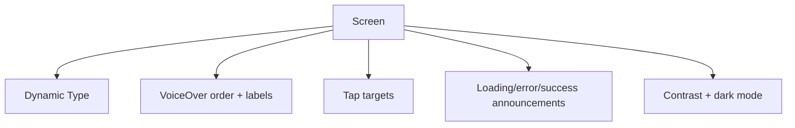

# Accessibility в реальном iOS продукте

> **Коротко:** Accessibility — это не отдельная галочка перед релизом. Это проверка, может ли человек реально пройти сценарий: понять экран, нажать нужное, не потеряться после ошибки.

## Рабочая модель
В iOS чаще всего ломаются не сложные accessibility API, а простые вещи:

- текст обрезается на Dynamic Type;
- VoiceOver читает набор лейблов вместо смысла;
- кнопка мала для тапа;
- кастомный control не имеет роли;
- error state визуально есть, но VoiceOver о нем не узнает;
- порядок фокуса не совпадает с визуальной иерархией.



## Где это ломается
Форма оплаты. В обычном размере все красиво. При XXL:

- сумма уехала в две строки и закрыла кнопку;
- ошибка под полем не читается VoiceOver;
- кастомный переключатель «сохранить карту» читается как обычный текст;
- кнопка «Оплатить» disabled, но не объясняет почему.

## Разбор в коде

```swift
struct PaymentSummaryView: View {
    let amount: String
    let isPayEnabled: Bool
    let disabledReason: String?
    let onPay: () -> Void

    var body: some View {
        VStack(alignment: .leading, spacing: 16) {
            Text("К оплате")
                .font(.headline)

            Text(amount)
                .font(.largeTitle.bold())
                .minimumScaleFactor(0.8)
                .accessibilityLabel("Сумма к оплате \(amount)")

            Button(action: onPay) {
                Text("Оплатить")
                    .frame(maxWidth: .infinity, minHeight: 52)
            }
            .buttonStyle(.borderedProminent)
            .disabled(!isPayEnabled)
            .accessibilityHint(disabledReason ?? "Переход к оплате")
        }
        .accessibilityElement(children: .contain)
    }
}
```

Для disabled-кнопки hint важен: пользователь должен понять не только факт недоступности, но и причину.

## Редкие поломки
- `accessibilityLabel` дублирует visible text и делает речь длиннее без пользы.
- `VStack` случайно объединен в один accessibility element, и поля формы перестали быть отдельными.
- Error появился после async-валидации, но VoiceOver focus остался на кнопке.
- Иконка без текста понятна зрячему пользователю, но VoiceOver читает `image`.
- Кастомный drag/slider невозможно использовать без жеста.
- Локализованный текст стал длиннее и сломал tap target.

## Самопроверка
- Можно ли пройти экран VoiceOver без подсказки от дизайнера?  
  Ответ: если порядок чтения совпадает со смыслом, да. Если VoiceOver скачет по декоративным элементам, нет.
- Кнопки имеют нормальную область тапа?  
  Ответ: минимум около 44x44 pt, даже если визуально элемент меньше.
- Error state озвучивается?  
  Ответ: важную ошибку надо либо фокусировать, либо объявлять через accessibility announcement.
- Disabled state объяснен?  
  Ответ: если действие недоступно, пользователь должен понять почему.
- Dynamic Type проверен на больших размерах?  
  Ответ: да, иначе «поддерживаем accessibility» остается декларацией.

Связано: [Design System для iOS продукта](<Design System для iOS продукта.md>), [SwiftUI state identity effects](<SwiftUI state identity effects.md>), [Unit UI Tests для сложных iOS флоу](<../04 Тесты CI и релиз/Unit UI Tests для сложных iOS флоу.md>)
