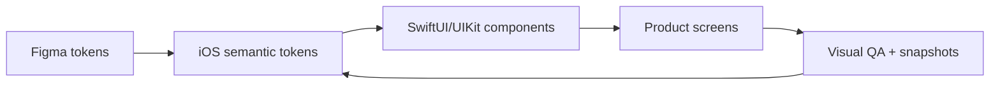

# Design System для iOS продукта

> **Коротко:** Design System нужен не для красивой папки с цветами. Он нужен, чтобы продукт мог расти без визуального долга, случайных кнопок и вечных споров «а тут какой серый?».

## Где это всплывает в работе
Через пару лет продукт обычно получает несколько команд, эксперименты, dark mode, локализацию, Dynamic Type, промо-экраны и старые UIKit-куски рядом со SwiftUI. Если дизайн-система держится только на Figma и договоренностях в чате, код быстро превращается в набор похожих, но разных решений.

Разработчик, который отвечает за качество интерфейса, должен уметь перевести дизайн-систему в код так, чтобы она:

- защищала продукт от визуального расползания;
- не мешала фичам двигаться быстро;
- была понятна дизайнеру, разработчику и QA;
- выдерживала SwiftUI, UIKit и постепенную миграцию.

## Рабочая модель
Сильная дизайн-система состоит не из «цветов и шрифтов», а из решений:

- semantic tokens: не `blue500`, а `actionPrimaryBackground`;
- typography roles: не «шрифт 17», а `body`, `headline`, `caption`;
- component contracts: что кнопка обещает по состояниям, размерам и доступности;
- usage rules: где можно использовать компонент, а где он уже ломает смысл;
- migration path: как старые экраны приходят к системе без большого переписывания.



## Живой сценарий
В продукте есть три типа действий:

- главное действие: купить, отправить, подтвердить;
- вторичное: изменить, посмотреть детали;
- опасное: удалить, отменить, выйти.

Если каждая команда делает кнопку сама, через месяц будет десять версий «главной» кнопки. Пользователь это чувствует: интерфейс вроде работает, но доверия меньше.

## Сложный кейс в коде
Пример показывает не полный дизайн-кит, а важную идею: экран не выбирает конкретный цвет. Экран выбирает смысл.

```swift
struct AppTheme {
    struct Colors {
        let actionPrimaryBackground: Color
        let actionPrimaryForeground: Color
        let surfacePrimary: Color
        let textPrimary: Color
        let textSecondary: Color
        let destructiveBackground: Color
    }

    struct Radius {
        let control: CGFloat
        let container: CGFloat
    }

    let colors: Colors
    let radius: Radius
}

private struct AppThemeKey: EnvironmentKey {
    static let defaultValue = AppTheme(
        colors: .init(
            actionPrimaryBackground: .blue,
            actionPrimaryForeground: .white,
            surfacePrimary: Color(.systemBackground),
            textPrimary: Color(.label),
            textSecondary: Color(.secondaryLabel),
            destructiveBackground: .red
        ),
        radius: .init(control: 10, container: 14)
    )
}

extension EnvironmentValues {
    var appTheme: AppTheme {
        get { self[AppThemeKey.self] }
        set { self[AppThemeKey.self] = newValue }
    }
}

struct PrimaryActionButtonStyle: ButtonStyle {
    @Environment(\.appTheme) private var theme
    @Environment(\.isEnabled) private var isEnabled

    func makeBody(configuration: Configuration) -> some View {
        configuration.label
            .font(.headline)
            .frame(maxWidth: .infinity, minHeight: 52)
            .foregroundStyle(theme.colors.actionPrimaryForeground)
            .background(theme.colors.actionPrimaryBackground.opacity(isEnabled ? 1 : 0.45))
            .clipShape(RoundedRectangle(cornerRadius: theme.radius.control, style: .continuous))
            .scaleEffect(configuration.isPressed ? 0.98 : 1)
            .animation(.snappy(duration: 0.12), value: configuration.isPressed)
    }
}
```

Такой код полезен не потому, что он «красивый». Он заставляет продукт говорить на языке назначения. Если завтра брендовый синий изменится, экран покупки не должен знать об этом.

## Что должно быть в компоненте, а не в каждом экране
- disabled, loading, pressed, focus states;
- Dynamic Type и минимальная высота тапа;
- правила иконки: когда она нужна, где стоит, что происходит при длинном тексте;
- dark mode и high contrast;
- snapshot/preview на базовые состояния.

## Редкие поломки
- Цвет назвали по внешнему виду, а не по смыслу. Через ребрендинг `blueButton` становится зеленым, и код начинает врать.
- Дизайн-система есть в SwiftUI, но UIKit-экраны живут отдельно. В итоге продукт визуально двоится.
- Компонент слишком умный: в него зашили бизнес-правила, и теперь он не переиспользуется.
- Компонент слишком тупой: каждый экран сам решает loading, disabled и accessibility label.
- Snapshot-тесты проверяют пиксели, но не проверяют Dynamic Type и локализацию.

## Самопроверка
- Могу ли я объяснить токен по смыслу, а не по цвету?  
  Ответ: `actionPrimaryBackground` живет дольше, чем `blue500`. Если название описывает внешний вид, ребрендинг быстро превратит код в ложь.
- У главной кнопки есть все состояния?  
  Ответ: должны быть минимум enabled, disabled, pressed, loading, multiline title и accessibility. Иначе каждый экран начнет чинить кнопку по-своему.
- Есть ли мост для UIKit?  
  Ответ: если в продукте есть UIKit-экраны, дизайн-система без UIKit-адаптера будет половинчатой.
- Что будет при немецкой локализации и XXL Dynamic Type?  
  Ответ: кнопка не должна обрезать текст, ломать высоту тапа и выталкивать соседний контент.
- Можно ли запретить новый случайный стиль?  
  Ответ: лучше через component review, snapshot/preview matrix и запрет прямого доступа к сырым цветам в feature-коде.

Связано: [SwiftUI state identity effects](<SwiftUI state identity effects.md>)
