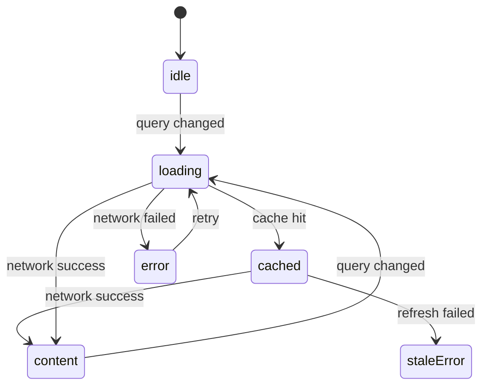

# SwiftUI state identity effects

> **Коротко:** В SwiftUI сложность редко начинается с `View`. Она начинается там, где состояние, identity и side effects живут в разных углах экрана и тихо спорят, кто сейчас главный.

## Где это всплывает в работе
На простом экране SwiftUI выглядит почти безобидно: есть `@State`, кнопка, список, `task`. На продовом экране появляются поиск, пагинация, deeplink, refresh, кеш, analytics, skeleton, retry и условная навигация. И вот уже главный вопрос не «как сверстать», а «почему этот экран сейчас показывает именно эти данные».

Хороший SwiftUI-код держится на трех вещах:

- один понятный источник правды;
- стабильная identity для всего, что может обновляться;
- side effects, привязанные к жизненному циклу, а не разбросанные по случайным `onAppear`.

## Рабочая модель
SwiftUI перерисовывает view часто. Это нормально. Опасно другое: когда перерисовка случайно перезапускает работу, ломает identity ячейки или возвращает старый результат поверх нового.

`View` не должен быть местом, где рождается вся бизнес-логика. Но `View` должен ясно показывать, какое состояние он рендерит. Если экран невозможно прочитать без охоты за флагами в пяти местах, значит модель состояния выбрана слабо.

## Живой сценарий
Экран поиска отелей:

- пользователь печатает быстро;
- старые запросы должны отменяться;
- при пустом запросе нужен не error, а idle;
- результат из кеша можно показать сразу, но потом обновить сетью;
- deeplink может открыть экран уже с готовым фильтром;
- при повторном заходе экран не должен моргнуть пустым состоянием.



## Сложный кейс в коде
Ниже не «идеальная архитектура на все случаи», а рабочий прием: один владелец состояния, явная отмена старой задачи и защита от позднего ответа.

```swift
@MainActor
final class HotelSearchViewModel: ObservableObject {
    enum State: Equatable {
        case idle
        case loading(query: String)
        case content(query: String, hotels: [HotelCard], isRefreshing: Bool)
        case empty(query: String)
        case error(query: String, message: String)
    }

    @Published private(set) var state: State = .idle

    private let service: HotelSearchService
    private var searchTask: Task<Void, Never>?
    private var latestRequestID: UUID?

    init(service: HotelSearchService) {
        self.service = service
    }

    func search(_ rawQuery: String) {
        let query = rawQuery.trimmingCharacters(in: .whitespacesAndNewlines)
        searchTask?.cancel()

        guard !query.isEmpty else {
            latestRequestID = nil
            state = .idle
            return
        }

        let requestID = UUID()
        latestRequestID = requestID
        state = .loading(query: query)

        searchTask = Task { [service] in
            do {
                try await Task.sleep(for: .milliseconds(250))
                try Task.checkCancellation()

                let hotels = try await service.searchHotels(query: query)
                try Task.checkCancellation()

                guard latestRequestID == requestID else { return }
                state = hotels.isEmpty ? .empty(query: query) : .content(
                    query: query,
                    hotels: hotels,
                    isRefreshing: false
                )
            } catch is CancellationError {
                return
            } catch {
                guard latestRequestID == requestID else { return }
                state = .error(query: query, message: "Не удалось обновить подборку")
            }
        }
    }

    deinit {
        searchTask?.cancel()
    }
}
```

Главная деталь здесь не `Task.sleep`, а `latestRequestID`. Отмена важна, но в реальной жизни поздние ответы все равно случаются: через слой кеша, мосты с legacy callback API, гонки после восстановления сети. Поэтому экран защищает себя не только отменой, но и проверкой актуальности результата.

## Где чаще всего ошибаются
- Используют `onAppear` как универсальный старт всего. Потом экран повторно появляется после sheet и снова грузит данные.
- Делают `ForEach(items.indices)`, а потом удивляются, что анимации, swipe actions и focus ведут себя странно.
- Хранят `isLoading`, `error`, `items`, `isEmpty` отдельно. Комбинаций становится больше, чем реальных состояний.
- Создают `ObservableObject` внутри view без стабильного владельца, и состояние сбрасывается при изменении родителя.
- Путают identity модели и identity строки. Если `id` приходит нестабильный, SwiftUI честно считает, что это новые элементы.

## Редкие поломки
- `task(id:)` перезапускается чаще ожидаемого, потому что `id` строится из нестабильной структуры.
- `NavigationStack` держит старый path после logout, если навигация не является частью сессионного состояния.
- `@StateObject` спасает lifetime, но не спасает от неправильного доменного состояния.
- Skeleton и empty state могут спорить, если `loading` представлен отдельным флагом.
- Старый запрос может вернуть «успех» после нового запроса с ошибкой. Без request identity экран покажет ложное спокойствие.

## Самопроверка
- Я могу назвать один главный источник правды для экрана?  
  Ответ: да, если состояние экрана собирается в одном `State` или одном владельце, а не размазано по `@State`, `@Published`, `Binding` и `onAppear`.
- Все состояния экрана взаимоисключающие?  
  Ответ: должны быть. Если одновременно возможны `isLoading == true`, `items.isEmpty == true` и `error != nil`, экран уже живет в противоречии.
- Есть ли защита от позднего ответа?  
  Ответ: нужна проверка актуальности: request id, query id, session id или отменяемая задача с guard после `await`.
- Стабильны ли `id` у элементов списка?  
  Ответ: стабильный `id` должен приходить из домена. Индекс массива подходит только для статичного списка без удаления, сортировки и анимаций.
- Понятно ли, что произойдет при deeplink, refresh и уходе со страницы?  
  Ответ: если это нельзя объяснить без запуска приложения, state machine экрана еще не доросла до продового сценария.

## Практика на вечер
Возьми экран со списком и поиском. Перепиши его state в `enum`, убери разрозненные флаги и добавь тест на сценарий: первый запрос стартовал, второй обогнал его, старый ответ не попал в UI.

Мини-челлендж: добавь кеш так, чтобы кешированный результат показывался сразу, но ошибка refresh не стирала уже показанные данные.

Связано: [SwiftUI architecture (advanced)](<SwiftUI architecture advanced.md>), [Structured Concurrency под нагрузкой](<../08 Concurrency/Structured Concurrency под нагрузкой.md>), [Unit UI Tests для сложных iOS флоу](<../04 Тесты CI и релиз/Unit UI Tests для сложных iOS флоу.md>), [Design System для iOS продукта](<Design System для iOS продукта.md>)
