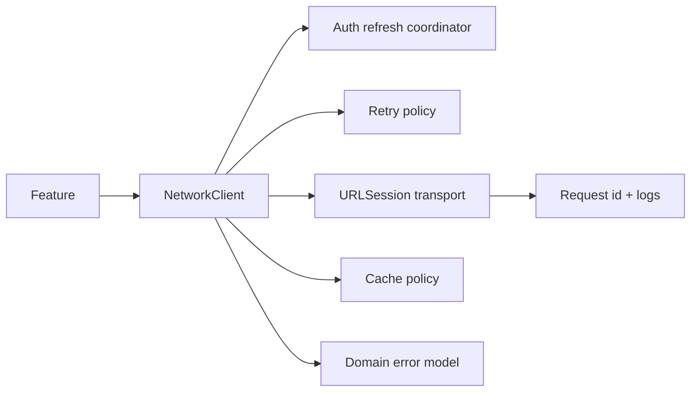

# Networking слой без сюрпризов

> **Коротко:** Сильный networking слой не обещает, что сеть будет хорошей. Он обещает, что плохая сеть, отмена, 401, retry, кеш и поздние ответы будут вести себя предсказуемо.

## Где это всплывает в работе
У большинства iOS-приложений сетевой слой сначала выглядит нормально: есть `URLSession`, `Endpoint`, `Decodable`. Потом приходят реальные требования:

- refresh token;
- retry с backoff;
- request id для логов;
- отмена;
- offline mode;
- stale cache;
- разные правила для GET и POST;
- защита от 401 storm;
- трассировка пользовательского сценария.

Если это решать по одному экрану за раз, продукт получает семь разных сетевых поведений.

## Рабочая модель
Сетевой слой должен переводить хаос внешнего мира в понятный контракт для фичи.



Верхний слой не должен разбирать `URLError` и угадывать, можно ли повторить запрос. Он должен получить ошибку уровня продукта: noConnection, timeout, unauthorized, cancelled, serverUnavailable, decoding, forbidden.

## Живой сценарий
Экран бронирований. Пользователь открыл приложение в метро. Кеш есть, сеть плохая, token истек, два запроса одновременно получили 401. Правильное поведение:

- показать кеш как stale content;
- выполнить один refresh token, а не два;
- безопасно повторить только чтение;
- не ретраить неидемпотентную оплату;
- не стереть кеш пустой ошибкой;
- показать пользователю честный статус обновления.

## Сложный кейс в коде
Single-flight refresh coordinator защищает от ситуации, когда несколько запросов одновременно начинают refresh.

```swift
actor AuthRefreshCoordinator {
    private var refreshTask: Task<AuthToken, Error>?
    private let authAPI: AuthAPI

    init(authAPI: AuthAPI) {
        self.authAPI = authAPI
    }

    func validToken() async throws -> AuthToken {
        if let refreshTask {
            return try await refreshTask.value
        }

        let task = Task { try await authAPI.refreshToken() }
        refreshTask = task

        do {
            let token = try await task.value
            refreshTask = nil
            return token
        } catch {
            refreshTask = nil
            throw error
        }
    }
}
```

Клиент должен знать, что можно повторять:

```swift
enum HTTPMethod {
    case get
    case post(idempotencyKey: String?)
    case put
    case delete
}

enum RetryPolicy {
    case never
    case safeRead
    case idempotentMutation(key: String)

    var canRetryAfterTimeout: Bool {
        switch self {
        case .never:
            return false
        case .safeRead, .idempotentMutation:
            return true
        }
    }
}

extension HTTPMethod {
    var rawValue: String {
        switch self {
        case .get:
            return "GET"
        case .post:
            return "POST"
        case .put:
            return "PUT"
        case .delete:
            return "DELETE"
        }
    }
}

enum NetworkError: Error, Equatable {
    case cancelled
    case noConnection
    case timeout
    case unauthorized
    case forbidden
    case serverUnavailable
    case decoding
    case unknown
}
```

Главная мысль: retry — это не «попробуем еще раз». Retry — это бизнес-решение. Для чтения бронирований нормально. Для оплаты без idempotency key — опасно.

## Редкие поломки
- Refresh token упал. Все ожидающие запросы должны получить один понятный результат, а не каждый свою странную ошибку.
- Запрос отменили, но retry policy все равно запланировала повтор.
- POST повторился без idempotency key.
- Backend вернул 200 с бизнес-ошибкой в body. Это не transport success для фичи.
- Декодинг упал из-за одного необязательного поля. Вопрос: это фатально или нужен tolerant decoding?
- Cache hit показал старые данные, потом сеть вернула ошибку. UI не должен превращать content в пустой error.
- Request id не прокинут в логи, и продовый инцидент нельзя связать с экраном.

## Самопроверка
- Есть ли единая error model?  
  Ответ: да, если фича получает `NetworkError`/domain error, а не разбирает `URLError`, status code и текст ответа сама.
- Где живет retry policy?  
  Ответ: в сетевом слое или отдельной policy, но не в каждом экране. Экран не должен знать backoff-математику.
- Чем отличается отмена от ошибки?  
  Ответ: отмена — нормальный lifecycle-сценарий. Ее не показывают как alert и не считают failure.
- Какие методы можно автоматически повторять?  
  Ответ: не методы сами по себе, а операции с явной retry policy: безопасные чтения и мутации с idempotency key. POST/PUT/DELETE без политики повторять опасно.
- Что произойдет при двух одновременных 401?  
  Ответ: должен быть один refresh token, остальные запросы ждут его результат.
- Может ли старый ответ перетереть более новый state?  
  Ответ: сетевой слой может помочь отменой, но окончательная защита обычно выше: request id, query id, version.
- Есть ли request id или trace id для продового разбора?  
  Ответ: нужен. Без него мобильный лог сложно связать с backend-логом и конкретной жалобой.

## Мини-клиент на fake transport
Такой маленький клиент удобно держать в заметках: он показывает правила без реального backend и без магии `URLSession`.

```swift
struct Endpoint<Response: Decodable> {
    let path: String
    let method: HTTPMethod
    let retryPolicy: RetryPolicy
}

struct TransportResponse {
    let statusCode: Int
    let data: Data
}

protocol NetworkTransport {
    func send(_ request: URLRequest) async throws -> TransportResponse
}

final class FakeTransport: NetworkTransport {
    enum Step {
        case success(status: Int, body: String)
        case failure(Error)
    }

    private var steps: [Step]
    private(set) var sentRequests: [URLRequest] = []

    init(steps: [Step]) {
        self.steps = steps
    }

    func send(_ request: URLRequest) async throws -> TransportResponse {
        sentRequests.append(request)

        guard !steps.isEmpty else {
            throw NetworkError.unknown
        }

        switch steps.removeFirst() {
        case .success(let status, let body):
            return TransportResponse(
                statusCode: status,
                data: Data(body.utf8)
            )
        case .failure(let error):
            throw error
        }
    }
}

final class NetworkClient {
    private let baseURL: URL
    private let transport: NetworkTransport
    private let decoder: JSONDecoder

    init(baseURL: URL, transport: NetworkTransport, decoder: JSONDecoder = .init()) {
        self.baseURL = baseURL
        self.transport = transport
        self.decoder = decoder
    }

    func request<Response: Decodable>(_ endpoint: Endpoint<Response>) async throws -> Response {
        var request = URLRequest(url: baseURL.appendingPathComponent(endpoint.path.trimmingCharacters(in: CharacterSet(charactersIn: "/"))))
        request.httpMethod = endpoint.method.rawValue

        let response = try await sendWithRetry(request, retryPolicy: endpoint.retryPolicy)

        guard (200..<300).contains(response.statusCode) else {
            throw mapStatus(response.statusCode)
        }

        do {
            return try decoder.decode(Response.self, from: response.data)
        } catch {
            throw NetworkError.decoding
        }
    }

    private func sendWithRetry(_ request: URLRequest, retryPolicy: RetryPolicy) async throws -> TransportResponse {
        do {
            return try await transport.send(request)
        } catch is CancellationError {
            throw NetworkError.cancelled
        } catch NetworkError.timeout where retryPolicy.canRetryAfterTimeout {
            try Task.checkCancellation()
            return try await transport.send(request)
        } catch {
            throw error
        }
    }

    private func mapStatus(_ statusCode: Int) -> NetworkError {
        switch statusCode {
        case 401: return .unauthorized
        case 403: return .forbidden
        case 500...599: return .serverUnavailable
        default: return .unknown
        }
    }
}
```

Проверки, которые обычно пишу первыми:

```swift
struct BookingDTO: Decodable, Equatable {
    let id: String
}

func testGetRetriesAfterTimeout() async throws {
    let transport = FakeTransport(steps: [
        .failure(NetworkError.timeout),
        .success(status: 200, body: #"{"id":"b1"}"#)
    ])

    let client = NetworkClient(
        baseURL: URL(string: "https://example.com")!,
        transport: transport
    )

    let endpoint = Endpoint<BookingDTO>(
        path: "/bookings/b1",
        method: .get,
        retryPolicy: .safeRead
    )
    let booking = try await client.request(endpoint)

    XCTAssertEqual(booking, BookingDTO(id: "b1"))
    XCTAssertEqual(transport.sentRequests.count, 2)
}

func testPostWithoutIdempotencyKeyDoesNotRetry() async {
    let transport = FakeTransport(steps: [
        .failure(NetworkError.timeout)
    ])

    let client = NetworkClient(
        baseURL: URL(string: "https://example.com")!,
        transport: transport
    )

    let endpoint = Endpoint<BookingDTO>(
        path: "/payments",
        method: .post(idempotencyKey: nil),
        retryPolicy: .never
    )

    do {
        _ = try await client.request(endpoint)
        XCTFail("POST без idempotency key не должен ретраиться")
    } catch {
        XCTAssertEqual(transport.sentRequests.count, 1)
    }
}
```

Этот кусок не закрывает весь networking. Зато он быстро показывает, где живут retry, mapping ошибок, cancellation и typed endpoint.

Связано: [Networking resilience](<Networking resilience.md>), [WebSocket в продакшене](<WebSocket в продакшене.md>), [Structured Concurrency под нагрузкой](<../08 Concurrency/Structured Concurrency под нагрузкой.md>), [Async XCTest](<../04 Тесты CI и релиз/Async XCTest.md>), [Persistence + caching strategy](<Persistence + caching strategy.md>), [Observability](<../06 Производительность и наблюдаемость/Observability.md>)
