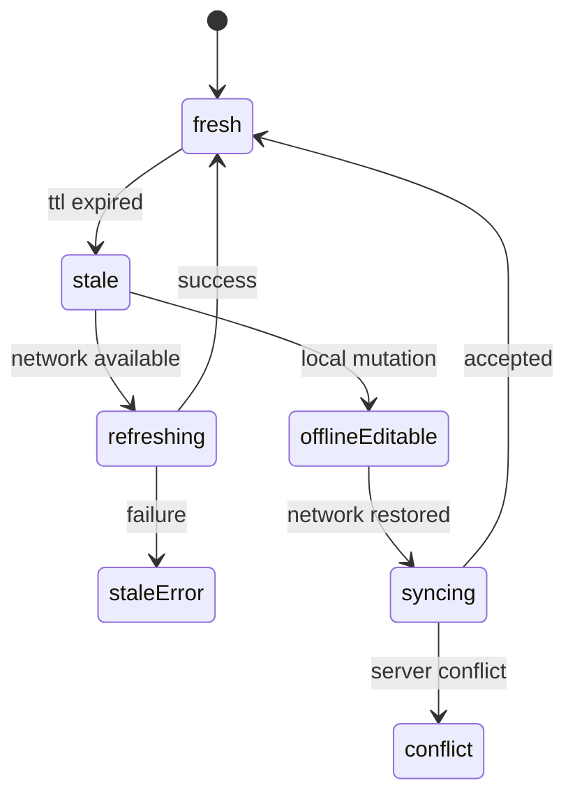

# Offline-first и консистентность данных

> **Коротко:** Offline-first не значит «положили JSON в кеш». Это честный договор: какие данные можно показывать устаревшими, какие нельзя, как решать конфликты и что пользователь увидит без сети.

## Где это всплывает в работе
Мобильное приложение живет в лифте, метро, аэропорту, роуминге и режиме «я быстро свернул и вернулся». Если хранение данных сделано как случайный кеш после сетевого ответа, продукт будет выглядеть быстрым только в хороших условиях.

Нормальный подход: хранение — это часть UX, а не техническая оптимизация.

## Рабочая модель
Для каждого типа данных надо ответить:

- можно ли показывать stale-версию;
- сколько она живет;
- что важнее при конфликте: локальная правка или сервер;
- можно ли выполнить действие offline;
- как пользователь узнает, что данные не свежие;
- как восстановиться после неудачной синхронизации.



## Живой сценарий
Travel-приложение показывает бронирование. Без сети пользователь должен видеть номер отеля, адрес и даты. Но кнопку «оплатить» нельзя просто считать доступной, если статус мог измениться на сервере.

Значит, одно и то же бронирование содержит разные уровни доверия:

- детали поездки можно показать stale;
- статус оплаты надо обновить перед действием;
- локальную заметку пользователя можно сохранить offline и синхронизировать позже.

## Сложный кейс в коде

```swift
struct CachedValue<Value: Codable>: Codable {
    let value: Value
    let savedAt: Date
    let maxAge: TimeInterval

    func freshness(now: Date) -> Freshness {
        now.timeIntervalSince(savedAt) <= maxAge ? .fresh : .stale
    }
}

enum Freshness: Equatable {
    case fresh
    case stale
}

enum DataSource<Value> {
    case cache(value: Value, freshness: Freshness)
    case network(value: Value)
}

actor BookingRepository {
    private let api: BookingAPI
    private let store: BookingStore
    private let now: () -> Date

    init(api: BookingAPI, store: BookingStore, now: @escaping () -> Date = Date.init) {
        self.api = api
        self.store = store
        self.now = now
    }

    func booking(id: String) async throws -> AsyncThrowingStream<DataSource<Booking>, Error> {
        AsyncThrowingStream { continuation in
            let task = Task {
                if let cached = try await store.loadBooking(id: id) {
                    continuation.yield(.cache(
                        value: cached.value,
                        freshness: cached.freshness(now: now())
                    ))
                }

                do {
                    let remote = try await api.loadBooking(id: id)
                    try await store.saveBooking(remote, maxAge: 300)
                    continuation.yield(.network(value: remote))
                    continuation.finish()
                } catch {
                    continuation.finish(throwing: error)
                }
            }

            continuation.onTermination = { _ in task.cancel() }
        }
    }
}
```

Здесь фича получает не просто `Booking`, а источник и свежесть. Это позволяет UI честно сказать: «показываем сохраненные данные, обновление не удалось», не превращая экран в пустую ошибку.

## Редкие поломки
- Кеш свежий по TTL, но пользователь сменил аккаунт.
- Сервер вернул объект без поля, которое есть в старом кеше. Нельзя молча склеивать несовместимые версии.
- Offline-действие выполнено дважды после восстановления сети.
- Локальная очередь мутаций пережила logout.
- Пользователь изменил одно поле, сервер изменил другое. Last write wins может потерять данные.
- Кеш ускорил экран, но analytics считает это полноценной успешной загрузкой.
- Дата устройства неверная, TTL начинает врать.

## Самопроверка
- Для каких данных stale допустим?  
  Ответ: для справочных и уже известных данных: адрес, прошлые операции, детали брони. Для оплаты, доступа и лимитов нужна свежесть.
- Где хранится принадлежность кеша к аккаунту?  
  Ответ: в ключе, namespace или metadata. Кеш без user/session scope опасен после logout/login.
- Есть ли версия схемы кеша?  
  Ответ: должна быть. Иначе старый JSON или старая база после релиза превращаются в лотерею.
- Что происходит с pending mutations после logout?  
  Ответ: они должны отменяться, чиститься или явно переноситься только при подтвержденном сценарии. Молчаливый replay после logout недопустим.
- Как UI отличает cache content от network content?  
  Ответ: через `freshness/source` в state. Если UI видит только модель, он не сможет честно показать «данные сохранены, обновление не прошло».
- Есть ли конфликтная стратегия, кроме «перезаписать»?  
  Ответ: хотя бы для пользовательского текста и локальных правок нужна стратегия merge/resolve, а не слепой last write wins.

Связано: [Persistence + caching strategy](<Persistence + caching strategy.md>), [Networking слой без сюрпризов](<Networking слой без сюрпризов.md>), [Unit UI Tests для сложных iOS флоу](<../04 Тесты CI и релиз/Unit UI Tests для сложных iOS флоу.md>), [Security (practical)](<../07 Безопасность/Security practical.md>)
