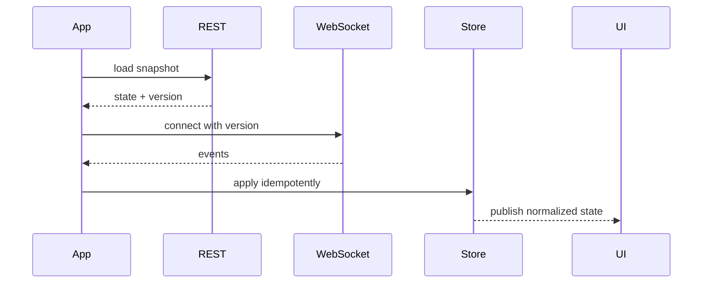

# WebSocket в продакшене

> **Коротко:** WebSocket ломается не тогда, когда не открывается соединение. Он ломается, когда приложение уходит в фон, сеть прыгает, сервер присылает дубли, а экран уже верит, что видит «живое» состояние.

## Где это всплывает в работе
WebSocket часто продают как «реалтайм». В коде это означает другое: долгоживущий ресурс, который надо подключать, закрывать, переподключать, авторизовать, наблюдать и не давать ему портить state.

Для iOS особенно важны:

- app lifecycle;
- плохая мобильная сеть;
- восстановление после foreground;
- порядок событий;
- идемпотентность;
- связь с обычным REST/bootstrap-запросом.

## Рабочая модель
WebSocket не должен быть вторым API, живущим отдельно от доменной модели. Обычно правильнее думать так:

1. REST дает стартовый снимок.
2. WebSocket приносит изменения.
3. Store применяет изменения идемпотентно.
4. UI подписывается на уже нормализованное состояние.



## Живой сценарий
Экран статуса заказа. Пользователь видит «курьер назначен», потом «курьер едет», потом «доставлено». Если WebSocket потерял событие в фоне, после возврата в приложение нельзя просто продолжить слушать поток. Нужно заново сверить snapshot и только потом принимать новые события.

## Сложный кейс в коде
Ниже actor, который превращает WebSocket в `AsyncThrowingStream`. Важная часть: соединение живет в одном владельце, а наружу уходит поток событий.

```swift
actor OrderSocketClient {
    enum SocketError: Error {
        case notConnected
        case invalidPayload
    }

    private let url: URL
    private let session: URLSession
    private var task: URLSessionWebSocketTask?

    init(url: URL, session: URLSession = .shared) {
        self.url = url
        self.session = session
    }

    func events(token: String, lastVersion: Int) -> AsyncThrowingStream<OrderEvent, Error> {
        AsyncThrowingStream { continuation in
            let listenTask = Task {
                await listen(token: token, lastVersion: lastVersion, continuation: continuation)
            }

            continuation.onTermination = { _ in
                listenTask.cancel()
                Task { await self.close() }
            }
        }
    }

    private func listen(
        token: String,
        lastVersion: Int,
        continuation: AsyncThrowingStream<OrderEvent, Error>.Continuation
    ) async {
        do {
            close()

            var request = URLRequest(url: url)
            request.setValue("Bearer \(token)", forHTTPHeaderField: "Authorization")
            request.setValue("\(lastVersion)", forHTTPHeaderField: "X-Last-Version")

            let socket = session.webSocketTask(with: request)
            task = socket
            socket.resume()

            while !Task.isCancelled {
                let message = try await socket.receive()
                let event = try decode(message)
                continuation.yield(event)
            }
        } catch is CancellationError {
            continuation.finish()
        } catch {
            continuation.finish(throwing: error)
        }
    }

    private func close() {
        task?.cancel(with: .goingAway, reason: nil)
        task = nil
    }

    private func decode(_ message: URLSessionWebSocketTask.Message) throws -> OrderEvent {
        switch message {
        case .data(let data):
            return try JSONDecoder().decode(OrderEvent.self, from: data)
        case .string(let text):
            guard let data = text.data(using: .utf8) else { throw SocketError.invalidPayload }
            return try JSONDecoder().decode(OrderEvent.self, from: data)
        @unknown default:
            throw SocketError.invalidPayload
        }
    }
}
```

Но одного клиента мало. Нужен слой, который применяет события с защитой от дублей:

```swift
struct OrderEvent: Decodable {
    let id: String
    let orderID: String
    let version: Int
    let status: OrderStatus
}

actor OrderStore {
    private var latestVersionByOrderID: [String: Int] = [:]

    func apply(_ event: OrderEvent) -> Bool {
        let current = latestVersionByOrderID[event.orderID, default: 0]
        guard event.version > current else { return false }

        latestVersionByOrderID[event.orderID] = event.version
        return true
    }
}
```

## Редкие поломки
- Сервер прислал одно событие два раза. UI не должен дважды показывать один и тот же переход.
- События пришли не по порядку после reconnect. Нужна версия или sequence number.
- App ушел в background: iOS не обещает вечную жизнь соединения.
- Токен истек во время открытого socket. Нужен понятный путь refresh/reconnect.
- Пользователь logout, но socket еще слушает старую сессию.
- REST snapshot старее, чем уже примененные socket-события. Store должен уметь сравнивать версии.
- Ping/pong есть, но UI все равно «зеленый», хотя доменные события давно не приходили.

## Самопроверка
- Есть ли стартовый snapshot перед подпиской?  
  Ответ: нужен почти всегда. Socket без snapshot дает поток изменений, но не гарантирует, что клиент знает исходное состояние.
- У событий есть id или версия?  
  Ответ: без id/version нельзя нормально отбросить дубль, старое событие или out-of-order update.
- Что произойдет после foreground?  
  Ответ: приложение должно сверить snapshot или last version, а не просто считать старое соединение живым.
- Кто закрывает socket при logout?  
  Ответ: владелец сессии. Если закрывает экран, socket может пережить logout и записать событие в чужой state.
- Может ли старое соединение записать событие в новую сессию?  
  Ответ: не должно. Нужен session guard или owner id на уровне store/apply.
- UI показывает реальное состояние или верит факту `socket connected`?  
  Ответ: `connected` говорит только о канале. Свежесть доменных данных подтверждает snapshot/version.

Связано: [Networking слой без сюрпризов](<Networking слой без сюрпризов.md>), [Structured Concurrency под нагрузкой](<../08 Concurrency/Structured Concurrency под нагрузкой.md>), [Observability](<../06 Производительность и наблюдаемость/Observability.md>), [Async XCTest](<../04 Тесты CI и релиз/Async XCTest.md>)
