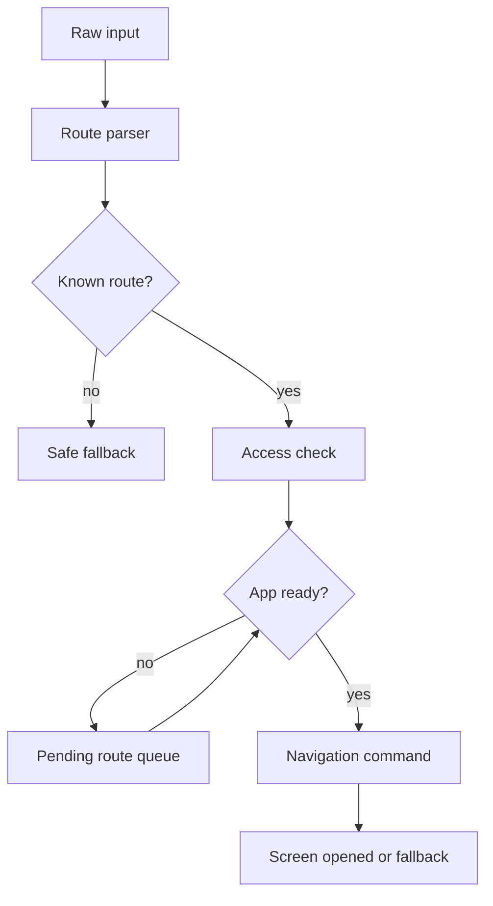

# App Lifecycle Deep Links Navigation

> **Коротко:** Deep link не обязан приходить в удобный момент. Он может прилететь из пуша, cold start, universal link, виджета или старого Safari-таба, когда приложение еще не восстановило сессию и не собрало навигацию.

## Где это всплывает в работе
Навигация редко ломается на демо. Она ломается в проде, когда пользователь нажал ссылку на заказ, приложение стартовало с нуля, auth еще проверяется, feature flags не загружены, а нужный модуль еще не готов принять route.

Нормальный подход: deep link — это не «сразу открыть экран», а доменное намерение, которое проходит через pipeline готовности приложения.

## Рабочая модель
У нормального route есть путь:

- вход: universal link, push, shortcut, widget, internal tap;
- парсинг: из сырого URL/payload в доменный route;
- проверка доступа: auth, роль, feature flag, существование объекта;
- ожидание готовности: session, root navigation, модуль;
- открытие: push/sheet/tab switch;
- fallback: что показать, если route устарел.



## Живой сценарий
Пользователь получил ссылку на оплату бронирования. Он не открывал приложение неделю. При тапе:

- токен мог протухнуть;
- бронирование могло быть отменено;
- таб оплаты может быть скрыт feature flag;
- приложение может открываться сразу после обновления версии;
- сервер может вернуть 403, если бронь уже не принадлежит пользователю.

Если route напрямую дергает экран оплаты, получится хрупкая магия. Если route проходит через доменную проверку, пользователь увидит либо оплату, либо честный fallback.

## Сложный кейс в коде

```swift
enum AppRoute: Equatable {
    case booking(id: String)
    case payment(bookingID: String)
    case support(threadID: String)
}

enum RouteResolution {
    case open(AppRoute)
    case requireLogin(AppRoute)
    case fallback(message: String)
}

struct RouteParser {
    func parse(_ url: URL) -> AppRoute? {
        let components = URLComponents(url: url, resolvingAgainstBaseURL: false)
        let path = components?.path.split(separator: "/").map(String.init) ?? []

        guard path.count >= 2 else { return nil }

        switch (path[0], path[1]) {
        case ("booking", let id):
            return .booking(id: id)
        case ("payment", let bookingID):
            return .payment(bookingID: bookingID)
        default:
            return nil
        }
    }
}

@MainActor
final class RouteCoordinator: ObservableObject {
    private var pendingRoutes: [AppRoute] = []
    private var isReady = false
    private var isDraining = false
    private let resolver: RouteResolver
    private let navigator: AppNavigator

    init(resolver: RouteResolver, navigator: AppNavigator) {
        self.resolver = resolver
        self.navigator = navigator
    }

    func receive(_ route: AppRoute) {
        pendingRoutes.append(route)
        drainIfPossible()
    }

    func markReady() {
        isReady = true
        drainIfPossible()
    }

    private func drainIfPossible() {
        guard isReady, !isDraining, !pendingRoutes.isEmpty else { return }
        isDraining = true

        Task {
            defer {
                isDraining = false
                drainIfPossible()
            }
            let route = pendingRoutes.removeFirst()

            switch await resolver.resolve(route) {
            case .open(let route):
                navigator.open(route)
            case .requireLogin(let route):
                pendingRoutes.removeAll()
                navigator.openLogin(returnTo: route)
            case .fallback(let message):
                navigator.showFallback(message)
            }
        }
    }
}
```

Ключевая идея: parsing, access check и navigation — разные ответственности. Если они смешаны, route становится невозможно тестировать без всего приложения.

## Редкие поломки
- Пришел второй deep link, пока первый еще ждет login.
- Universal link ведет на объект, который удалили.
- Пользователь открыл ссылку под другим аккаунтом.
- Приложение стартует в scene, где уже есть другой route.
- Feature flag выключил экран, но link еще гуляет в письмах.
- Навигация открыла sheet поверх onboarding.
- Route успешно распарсился, но доменный объект больше недоступен.

## Самопроверка
- Можно ли протестировать parser без UI?  
  Ответ: да. Переход `URL/payload -> optional AppRoute` должен проверяться обычным unit-тестом.
- Что делает route, если пользователь не авторизован?  
  Ответ: уходит в login с return route или в безопасный fallback. Route не должен сам решать auth.
- Есть ли pending queue при cold start?  
  Ответ: нужна хотя бы одна pending route. Без нее tap по пушу часто теряется до сборки root navigation.
- Что будет при двух route подряд?  
  Ответ: нужна политика: заменить, поставить в очередь или дедуплицировать. Иначе можно открыть два экрана поверх друг друга.
- Есть ли fallback для устаревших ссылок?  
  Ответ: да: объект удален, нет доступа, feature flag выключен. Белый экран или молчаливый home — плохой ответ.
- Не открывает ли deep link экран до готовности root navigation?  
  Ответ: не должен. Навигация должна стартовать после session restore и построения root.

Связано: [Push Notifications в продакшене](<Push Notifications в продакшене.md>), [SwiftUI state identity effects](<../01 SwiftUI и UI/SwiftUI state identity effects.md>)
