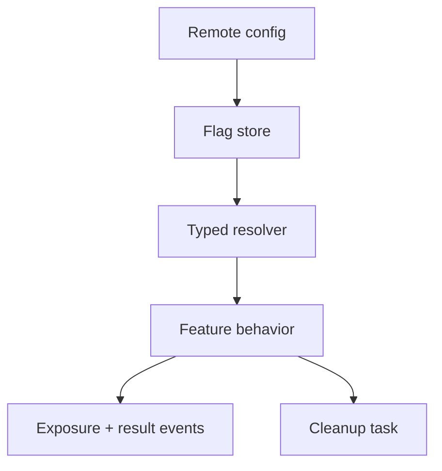

# Feature Flags и Remote Config

> **Коротко:** Feature flag — это не просто `if enabled`. Это временная развилка поведения, которая должна иметь владельца, fallback, срок жизни и понятный эффект на навигацию, тесты и аналитику.

## Рабочая модель
Флаги полезны, когда нужно:

- включить фичу постепенно;
- отключить опасный сценарий без релиза;
- провести A/B-тест;
- скрыть недоступный backend;
- разделить rollout по версии приложения, стране, роли или сегменту.

Но каждый флаг добавляет второй вариант реальности. Если его не удалить вовремя, код начинает жить в режиме вечного эксперимента.



## Где это ломается
Экран оплаты скрыт флагом. Push уже содержит route на оплату. Deep link из письма тоже ведет туда. Backend считает оплату доступной. Если флаг проверяется только в кнопке, пользователь все равно может попасть в закрытый экран другим путем.

Флаг должен жить не только в UI, а в resolver/router/business entry point.

## Разбор в коде

```swift
enum FeatureFlag: String {
    case newPaymentFlow
    case bookingChat
    case strictDocumentValidation
}

struct FeatureFlagsSnapshot: Sendable {
    let values: [FeatureFlag: Bool]
    let fetchedAt: Date

    func isEnabled(_ flag: FeatureFlag) -> Bool {
        values[flag, default: false]
    }
}

actor FeatureFlagStore {
    private var snapshot = FeatureFlagsSnapshot(values: [:], fetchedAt: .distantPast)

    func update(_ snapshot: FeatureFlagsSnapshot) {
        self.snapshot = snapshot
    }

    func isEnabled(_ flag: FeatureFlag) -> Bool {
        snapshot.isEnabled(flag)
    }
}

struct PaymentRouteResolver {
    let flags: FeatureFlagStore

    func resolvePaymentRoute(bookingID: String) async -> RouteResolution {
        guard await flags.isEnabled(.newPaymentFlow) else {
            return .fallback(message: "Оплата пока недоступна в приложении")
        }

        return .open(.payment(bookingID: bookingID))
    }
}
```

Проверка флага в router выглядит скучно, зато именно она закрывает push, deep link и внутренний tap одним правилом.

## Редкие поломки
- Флаг выключили, но старый route остался в pending queue.
- UI спрятал кнопку, но deep link открыл экран.
- Значение флага кешируется слишком долго после rollback.
- A/B exposure логируется при старте приложения, хотя пользователь не увидел эксперимент.
- Флаг зависит от версии приложения, но backend не знает эту версию.
- Флаг пережил эксперимент и стал вечной веткой в коде.

## Самопроверка
- У флага есть владелец и дата удаления?  
  Ответ: должны быть. Без этого флаг почти гарантированно станет постоянным долгом.
- Где проверяется флаг?  
  Ответ: в точке входа в поведение: route resolver, use case, factory. Проверка только в кнопке слабая.
- Что показываем при выключенном флаге?  
  Ответ: fallback должен быть явным: старый экран, недоступность, support или silent no-op.
- Exposure логируется честно?  
  Ответ: exposure стоит писать, когда пользователь реально увидел вариант, а не когда app скачал config.
- Тесты покрывают оба варианта?  
  Ответ: минимум один тест на enabled и один на disabled, особенно для navigation.

## Практика на вечер
Возьми одну фичу с флагом и проверь все входы: кнопка, push, deep link, restore state, shortcut. Если хотя бы один путь обходит flag resolver, флаг стоит не там.

Связано: [App Lifecycle Deep Links Navigation](<App Lifecycle Deep Links Navigation.md>), [Push Notifications в продакшене](<Push Notifications в продакшене.md>), [Unit UI Tests для сложных iOS флоу](<../04 Тесты CI и релиз/Unit UI Tests для сложных iOS флоу.md>), [Observability для iOS](<../06 Производительность и наблюдаемость/Observability для iOS.md>)
