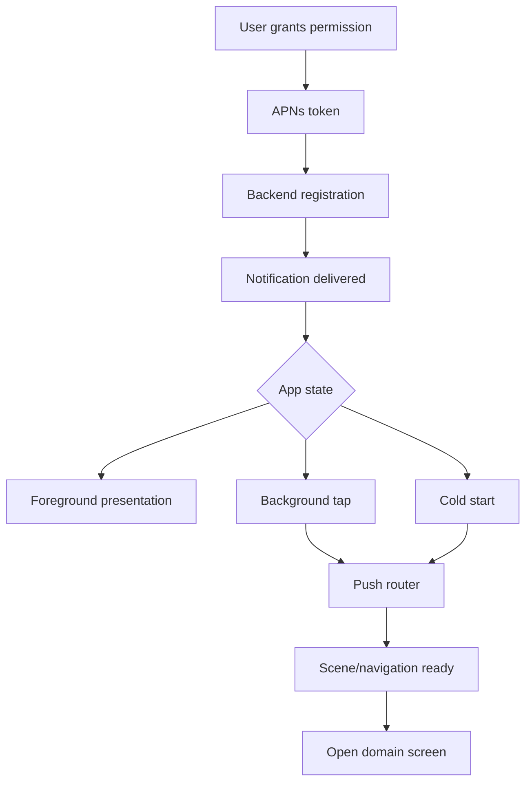

# Push Notifications в продакшене

> **Коротко:** Push Notification это не «показали баннер». Это доставка события через APNs, права пользователя, app lifecycle, deep link, аналитику и честную обработку случая, когда приложение еще не готово открыть нужный экран.

## Где это всплывает в работе
Пуши часто ломают не компиляцию, а доверие. Пользователь нажал на уведомление про оплату, приложение открылось, а там главный экран. Или пуш пришел в foreground, но UI молчит. Или token обновился, backend об этом не узнал.

Глубокий разбор начинается с вопроса: какой пользовательский сценарий этот push должен завершить?

## Рабочая модель
У пуша есть несколько разных путей:

- permission flow: можно ли вообще присылать уведомления;
- token registration: как backend узнает текущий APNs token;
- delivery: APNs доставляет или не доставляет, но не обещает бизнес-результат;
- presentation: что показываем в foreground;
- response: что делаем после tap/action;
- routing: как событие попадает в правильный экран.



## Живой сценарий
Пуш про изменение статуса заявки. Пользователь нажимает на уведомление, приложение стартует холодным запуском, сессия еще восстанавливается, root navigation еще не собран. Если сразу дернуть navigation, route потеряется. Нужен pending route, который дождется готовности приложения.

## Сложный кейс в коде
Пример: push response не открывает экран сам. Он превращается в доменное намерение, которое живет до момента, когда навигация готова.

```swift
enum PushRoute: Equatable {
    case order(id: String)
    case payment(id: String)
    case message(threadID: String)
}

@MainActor
final class PushRoutingStore: ObservableObject {
    @Published private(set) var pendingRoute: PushRoute?

    private var isNavigationReady = false
    private let openRoute: (PushRoute) -> Void

    init(openRoute: @escaping (PushRoute) -> Void) {
        self.openRoute = openRoute
    }

    func handleNotificationResponse(_ userInfo: [AnyHashable: Any]) {
        guard let route = PushRouteFactory.route(from: userInfo) else { return }

        pendingRoute = route
        drainIfPossible()
    }

    func markNavigationReady() {
        isNavigationReady = true
        drainIfPossible()
    }

    private func drainIfPossible() {
        guard isNavigationReady else { return }
        defer { pendingRoute = nil }
        if let pendingRoute {
            openRoute(pendingRoute)
        }
    }
}

final class NotificationDelegate: NSObject, UNUserNotificationCenterDelegate {
    private let routingStore: PushRoutingStore

    init(routingStore: PushRoutingStore) {
        self.routingStore = routingStore
    }

    func userNotificationCenter(
        _ center: UNUserNotificationCenter,
        didReceive response: UNNotificationResponse
    ) async {
        await routingStore.handleNotificationResponse(response.notification.request.content.userInfo)
    }

    func userNotificationCenter(
        _ center: UNUserNotificationCenter,
        willPresent notification: UNNotification
    ) async -> UNNotificationPresentationOptions {
        [.banner, .sound, .list]
    }
}
```

На уровне SwiftUI root:

```swift
.task {
    routingStore.markNavigationReady()
}
```

В настоящем приложении `drainIfPossible` обычно зависит еще от сессии, feature flags и root navigation. Главное — не считать tap по пушу обычным нажатием внутри уже готового UI.

## Редкие поломки
- APNs token меняется. Его нельзя считать вечным.
- Пользователь запретил уведомления, но backend продолжает считать его подписанным.
- Silent push не гарантирован, особенно при force quit и ограничениях системы.
- Push пришел в foreground: нужен отдельный UX, а не слепое открытие экрана.
- Пользователь нажал action на notification, а приложение еще не восстановило auth-сессию.
- Deep link из пуша ведет в объект, которого уже нет или к которому нет доступа.
- Один и тот же push может прийти на несколько устройств. Аналитика должна различать delivery, open и успешное открытие экрана.

## Самопроверка
- Что произойдет при cold start?  
  Ответ: payload должен превратиться в pending route и дождаться session/root navigation, а не пытаться открыть экран сразу из delegate.
- Где хранится pending route?  
  Ответ: в объекте уровня app/session coordinator. Не во view, потому что view может еще не существовать.
- Что делает приложение, если пользователь не авторизован?  
  Ответ: ведет на login с return route или показывает безопасный fallback. Пуш не должен обходить auth.
- Есть ли обработка устаревшего объекта?  
  Ответ: нужна. Заказ мог быть удален, оплата отменена, доступ отозван.
- Token registration идемпотентен?  
  Ответ: должен быть. APNs token может обновиться, а повторная регистрация не должна плодить дубли на backend.
- Foreground push не ломает текущий сценарий пользователя?  
  Ответ: foreground-пуш чаще показывает мягкое уведомление или обновляет state, а не вырывает пользователя на другой экран.

Связано: [SwiftUI state identity effects](<../01 SwiftUI и UI/SwiftUI state identity effects.md>), [Networking слой без сюрпризов](<../02 Сеть и данные/Networking слой без сюрпризов.md>)
