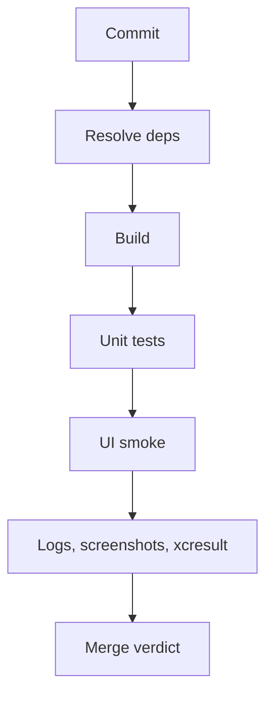

# CI для iOS без лотереи

> **Коротко:** CI должен быть скучным. Если он иногда красный «просто потому что iOS», команда перестает ему верить и начинает мержить на удачу.

## Рабочая модель
Надежный iOS CI держится на трех вещах:

- одинаковая среда;
- управляемые зависимости;
- тесты без случайного времени, сети и shared state.



## Где это ломается
UI-тест логина иногда падает: поле не найдено. Локально зеленый. В CI красный. Через неделю все нажимают rerun. Потом настоящий регресс тоже чинят rerun-ом.

Первый вопрос не «почему XCTest плохой», а «какой источник случайности мы оставили».

## Разбор в коде

```swift
enum UITestLaunchArguments {
    static let uiTestMode = "-uiTestMode"
    static let resetState = "-resetState"
}

@main
struct AppEntry: App {
    private let isUITestMode = ProcessInfo.processInfo.arguments.contains(UITestLaunchArguments.uiTestMode)

    var body: some Scene {
        WindowGroup {
            RootView()
                .task {
                    if isUITestMode {
                        await TestBootstrap.resetAndSeedIfNeeded()
                    }
                }
        }
    }
}
```

Идея простая: тестовый запуск должен явно сбросить состояние и поднять известный сценарий. Если тест случайно использует старый keychain/user defaults, он уже не тест.

## Редкие поломки
- CI использует другой Xcode patch version.
- Симулятор не очищается между тестами.
- Тест зависит от порядка выполнения.
- Snapshot падает из-за системного языка или appearance.
- DerivedData кеширует старый generated файл.
- UI-тест не сохраняет screenshot/xcresult, и падение невозможно разобрать.
- Rerun policy маскирует flaky вместо фикса.

## Самопроверка
- Можно ли объяснить, что именно проверяет CI job?  
  Ответ: build, unit, UI smoke, lint, snapshots — у каждого job должен быть смысл и owner.
- Среда закреплена?  
  Ответ: Xcode, iOS runtime, Ruby/Bundler/Tuist/SPM должны быть зафиксированы.
- Тесты очищают shared state?  
  Ответ: keychain, user defaults, database, cache и fake backend state должны сбрасываться.
- Есть артефакты падения?  
  Ответ: нужен `.xcresult`, logs, screenshots, sometimes video.
- Flaky помечаются как debt?  
  Ответ: rerun допустим временно, но flaky должен иметь owner и задачу на устранение.

## Практика на вечер
Возьми самый нестабильный UI-тест и найди источник случайности: время, сеть, storage, локаль, animation, порядок тестов или стартовое состояние.

Связано: [Unit UI Tests для сложных iOS флоу](<Unit UI Tests для сложных iOS флоу.md>), [Async XCTest](<Async XCTest.md>), [Release checklist для iOS](<Release checklist для iOS.md>), [Crash-free не равно stable](<Crash-free не равно stable.md>)
