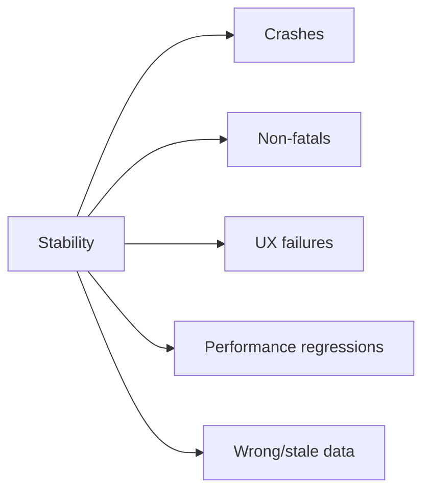

# Crash-free не равно stable

> **Коротко:** Высокий crash-free rate не доказывает, что приложение стабильное. Пользователь может не падать, но застревать в ошибке, терять route, видеть stale данные или ждать вечный loader.

## Рабочая модель
Стабильность шире crash-free:

- crash;
- non-fatal error;
- зависший loader;
- retry loop;
- route fallback;
- silent data loss;
- degraded performance;
- broken experiment branch.



## Где это ломается
Пользователь нажал пуш оплаты. Приложение не упало. Crash-free чистый. Но route не открылся, потому что feature flag еще не загрузился, а pending route потеряли. Для пользователя сценарий сломан, для crash dashboard — все зеленое.

## Разбор в коде

```swift
enum FlowResult: String {
    case success
    case fallback
    case cancelled
    case failed
}

struct StabilityEvent {
    let flowID: UUID
    let name: String
    let result: FlowResult
    let reason: String?
}

protocol StabilityReporting {
    func report(_ event: StabilityEvent)
}

final class PaymentOpenTracker {
    private let reporter: StabilityReporting

    init(reporter: StabilityReporting) {
        self.reporter = reporter
    }

    func trackPaymentOpen(flowID: UUID, resolution: RouteResolution) {
        switch resolution {
        case .open:
            reporter.report(.init(flowID: flowID, name: "payment_open", result: .success, reason: nil))
        case .requireLogin:
            reporter.report(.init(flowID: flowID, name: "payment_open", result: .fallback, reason: "login_required"))
        case .fallback:
            reporter.report(.init(flowID: flowID, name: "payment_open", result: .fallback, reason: "route_unavailable"))
        }
    }
}
```

Не каждый fallback — ошибка. Но если fallback rate внезапно вырос после релиза, это стабильность продукта, а не просто аналитика.

## Редкие поломки
- Non-fatal шумит так сильно, что реальные ошибки теряются.
- Loader висит бесконечно, но в crash dashboard все хорошо.
- Сценарий падает в fallback, но fallback не логируется.
- Ошибки группируются по тексту локализации, и после перевода график «изменился».
- Crash-free считается по сессиям, а критичный flow ломается у 20% пользователей внутри этих сессий.
- Watchdog termination выглядит не как обычный crash и легко пропускается.

## Самопроверка
- Какие flow-level метрики есть рядом с crash-free?  
  Ответ: success/fallback/failure rate для критичных маршрутов: login, payment, booking, push open.
- Логируются ли вечные loader-состояния?  
  Ответ: стоит иметь timeout или watchdog event на уровне сценария.
- Non-fatal ошибки сгруппированы по доменной причине?  
  Ответ: лучше по error code/domain, а не по тексту.
- Есть ли связь с релизом и feature flag?  
  Ответ: без version/build/flag snapshot сложно понять, что изменилось.
- Fallback считается нормой или деградацией?  
  Ответ: зависит от сценария. Но он должен быть видимым.

## Практика на вечер
Выбери один важный flow и выпиши не только crash, но и все «тихие провалы»: fallback, empty после ошибки, потерянный route, таймаут, повторный login, stale content.

Связано: [Observability для iOS](<../06 Производительность и наблюдаемость/Observability для iOS.md>), [Push Notifications в продакшене](<../03 Push Deep Links и флаги/Push Notifications в продакшене.md>), [App Lifecycle Deep Links Navigation](<../03 Push Deep Links и флаги/App Lifecycle Deep Links Navigation.md>), [Release checklist для iOS](<Release checklist для iOS.md>)
