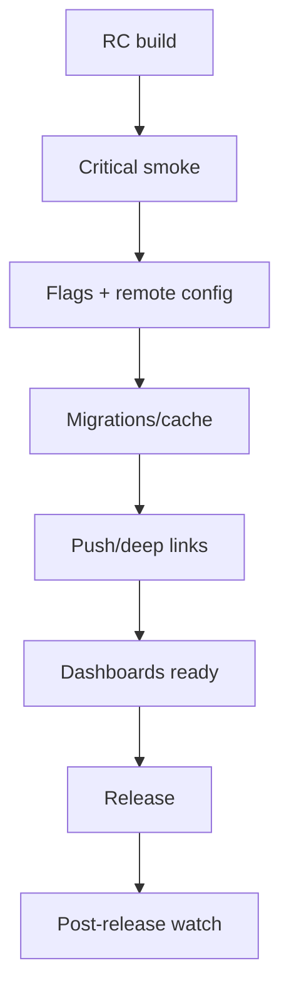

# Release checklist для iOS

> **Коротко:** Release checklist нужен не для галочки. Он защищает от скучных, дорогих ошибок: битый push route, забытый флаг, миграция без проверки, crash spike без owner.

## Рабочая модель
Хороший release checklist короткий, но привязан к реальным рискам продукта:

- auth/session;
- migrations/cache;
- push/deep links;
- feature flags;
- critical flows;
- observability;
- rollback plan.

## Где это ломается
Релиз прошел тесты, но после публикации:

- старый deep link из письма открыл пустой экран;
- remote config включил фичу на версии, где нет нужного экрана;
- миграция прошла на чистой базе, но упала на базе пользователя с тремя годами данных;
- crash-free зеленый, а payment fallback вырос.

## Рабочий чеклист
- Проверить cold start, login restore, logout/login другим аккаунтом.
- Прокликать push tap из killed/background/foreground.
- Проверить universal links на старые и новые route.
- Прогнать миграцию на старом fixture storage.
- Зафиксировать feature flags для релиза.
- Проверить, что critical dashboards знают новую версию.
- Проверить fallback copy на недоступный объект.
- Убедиться, что есть rollback/kill switch.

## Редкие поломки
- RC тестировали с debug config, release ушел с другим endpoint.
- Feature flag включился до backend rollout.
- Push category/action не совпала с entitlement/config.
- Store review build отличается от internal build.
- App update сохранил старую pending route.
- Watch dashboard фильтрует только crashes и не видит fallback spike.

## Самопроверка
- Есть список critical flows?  
  Ответ: должен быть маленький список, который реально прокликивают перед релизом.
- Флаги и remote config зафиксированы?  
  Ответ: перед релизом нужно знать, какие ветки поведения включены.
- Миграции проверены на старых данных?  
  Ответ: чистая установка не доказывает безопасность update.
- Есть post-release watch?  
  Ответ: первые часы после релиза важнее красивого release note.
- Есть kill switch?  
  Ответ: для рискованной фичи лучше иметь выключатель без нового билда.

## Практика на вечер
Составь release checklist из 10 пунктов для своего приложения. Удали все, что не проверяется реально. Добавь только то, что уже ломалось или может стоить денег/доверия.

Связано: [Crash-free не равно stable](<Crash-free не равно stable.md>), [Feature Flags и Remote Config](<../03 Push Deep Links и флаги/Feature Flags и Remote Config.md>), [Push Notifications в продакшене](<../03 Push Deep Links и флаги/Push Notifications в продакшене.md>), [Offline-first и консистентность данных](<../02 Сеть и данные/Offline-first и консистентность данных.md>)
