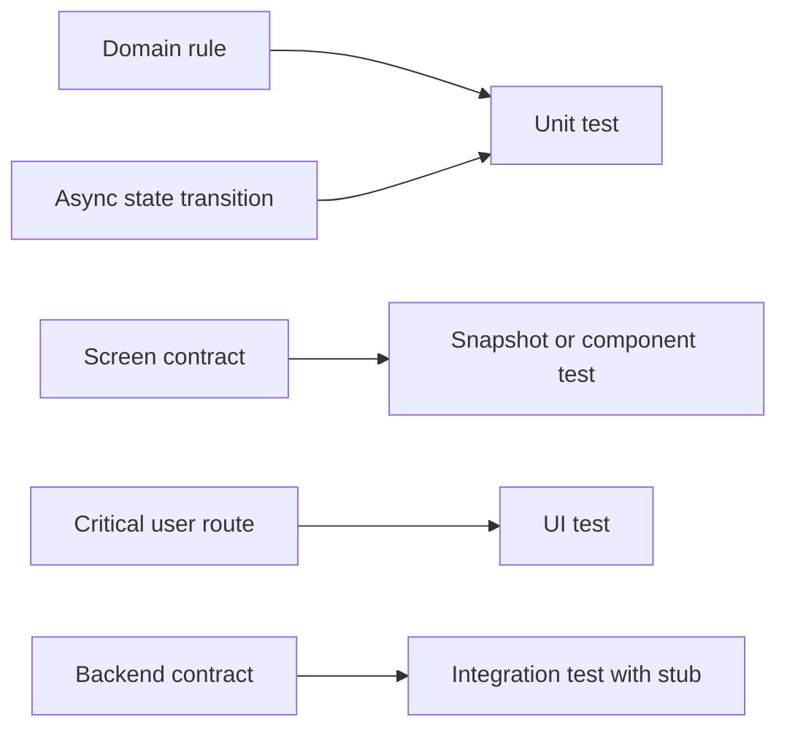

# Unit UI Tests для сложных iOS флоу

> **Коротко:** Хорошие тесты не доказывают, что код «как-то работает». Они защищают конкретное обещание продукта: старый запрос не перетрет новый, push откроет нужный экран, ошибка не съест уже показанные данные.

## Где это всплывает в работе
Мало уметь написать `XCTAssertEqual`. Нужно выбирать, что проверять unit-тестом, что интеграционно, а что через UI. И главное — сделать так, чтобы тесты не врали.

Флаки в iOS часто появляются из-за:

- реального времени вместо управляемого clock/scheduler;
- реальной сети;
- анимаций;
- гонок между view lifecycle и async-кодом;
- неявного состояния приложения между тестами;
- слишком широких тестов, где непонятно, что именно сломалось.

## Рабочая модель
Unit-тест хорош там, где нужно доказать правило. UI-тест хорош там, где нужно доказать пользовательский маршрут. Если UI-тест проверяет бизнес-алгоритм, он будет медленным и хрупким. Если unit-тест пытается доказать, что экран реально кликается, он слишком далеко от пользователя.



## Живой сценарий
Экран поиска. Пользователь вводит `par`, затем быстро `paris`. Первый запрос приходит позже второго. Правильное поведение: UI показывает `paris`, а не старый `par`.

Это не мелочь. На таких гонках рождаются жалобы «я выбрал одно, а приложение показало другое».

## Сложный кейс в коде
Unit-тест должен управлять зависимостью, а не ждать «чуть-чуть».

```swift
@MainActor
final class SearchServiceStub: HotelSearchService {
    private var continuations: [String: CheckedContinuation<[HotelCard], Error>] = [:]

    func searchHotels(query: String) async throws -> [HotelCard] {
        try await withCheckedThrowingContinuation { continuation in
            continuations[query] = continuation
        }
    }

    func complete(query: String, with hotels: [HotelCard]) {
        continuations[query]?.resume(returning: hotels)
        continuations[query] = nil
    }
}

@MainActor
final class HotelSearchViewModelTests: XCTestCase {
    func testLateFirstResponseDoesNotOverwriteNewerResult() async {
        let service = SearchServiceStub()
        let viewModel = HotelSearchViewModel(service: service)

        viewModel.search("par")
        viewModel.search("paris")

        service.complete(query: "paris", with: [.init(id: "1", title: "Paris Center")])
        await Task.yield()

        service.complete(query: "par", with: [.init(id: "2", title: "Old result")])
        await Task.yield()

        XCTAssertEqual(
            viewModel.state,
            .content(query: "paris", hotels: [.init(id: "1", title: "Paris Center")], isRefreshing: false)
        )
    }
}
```

Для UI-теста лучше не поднимать реальный backend. Приложение должно стартовать в тестовом режиме:

```swift
final class SearchFlowUITests: XCTestCase {
    func testSearchOpensHotelDetails() {
        let app = XCUIApplication()
        app.launchEnvironment["UITEST_MODE"] = "1"
        app.launchEnvironment["STUB_SCENARIO"] = "search_paris_success"
        app.launch()

        app.searchFields["hotel_search"].tap()
        app.searchFields["hotel_search"].typeText("Paris")
        app.cells["hotel_1"].tap()

        XCTAssertTrue(app.staticTexts["Paris Center"].waitForExistence(timeout: 2))
    }
}
```

Ключ здесь не в `timeout: 2`, а в том, что сценарий детерминирован: backend стаб, данные известны, accessibility identifiers стабильны.

## Редкие поломки
- Тест проходит только потому, что `Task.yield()` случайно дал нужный порядок. Нужен явный сигнал завершения.
- UI-тест зависит от языка устройства: текст кнопки изменился, тест упал.
- Анимация перекрывает кнопку, и tap иногда не проходит.
- Тесты делят один keychain/user defaults и влияют друг на друга.
- CI медленнее локальной машины, и «подождем секунду» превращается в лотерею.
- Snapshot обновили пачкой, но никто не посмотрел, что реально изменилось.

## Самопроверка
- Какое одно обещание защищает этот тест?  
  Ответ: формулировка должна быть конкретной: «старый ответ не перетирает новый», «cancel не показывает error», «deep link открывается после auth».
- Если тест упадет, будет понятно, что чинить?  
  Ответ: да, если тест проверяет один переход или один маршрут. Если он валит сразу сеть, storage и UI, сигнал слабый.
- Есть ли реальное время, сеть или shared storage?  
  Ответ: в unit-тесте их быть не должно. В UI-тесте они должны быть под тестовым режимом и стабами.
- Можно ли воспроизвести падение локально?  
  Ответ: хороший тест не требует угадывать тайминг. Нужен управляемый fake, continuation, clock или явный event.
- UI-тест проверяет маршрут, а не внутреннюю бизнес-логику?  
  Ответ: UI-тест должен кликать путь пользователя. Правила retry, сортировки и маппинга дешевле держать ниже.

## Практика на вечер
Возьми флоу «поиск → результат → детали». Напиши:

- unit-тест на поздний ответ;
- unit-тест на ошибку после кешированного content;
- UI-тест на успешный маршрут со стабом;
- UI-тест на empty state без реальной сети.

Мини-челлендж: добавь fail-fast проверку, что приложение запущено именно в `UITEST_MODE`, иначе тест не стартует.

Связано: [Async XCTest](<Async XCTest.md>), [SwiftUI state identity effects](<../01 SwiftUI и UI/SwiftUI state identity effects.md>), [Networking слой без сюрпризов](<../02 Сеть и данные/Networking слой без сюрпризов.md>)
