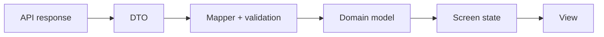

# DTO mapping и domain models

> **Коротко:** DTO приходит из внешнего мира. Domain model живет в продукте. Если их смешать, backend начинает диктовать UI, кеш, тесты и бизнес-правила.

## Рабочая модель
DTO удобно декодировать. Domain model удобно понимать. Это разные задачи.

В нормальном коде сетевой ответ проходит несколько ступеней:



Главное место — mapper. Именно там решается, что делать с битым полем, устаревшим enum, пустым названием, лишним статусом или странной датой. Если фича сразу ест DTO, все эти решения расползаются по экрану.

## Где это ломается
На экране бронирования backend возвращает:

- `status: "paid" | "cancelled" | "unknown_new_status"`;
- цену в копейках;
- дату в UTC;
- иногда пустой `hotelName`;
- иногда `paymentDeadline = null`.

Если DTO сразу уходит в SwiftUI, view начинает знать про копейки, UTC, null и неизвестные статусы. Через пару релизов экран уже невозможно читать.

## Разбор в коде

```swift
struct BookingDTO: Decodable {
    let id: String
    let hotelName: String?
    let status: String
    let priceCents: Int
    let paymentDeadline: String?
}

struct Booking {
    enum Status: Equatable {
        case draft
        case paid
        case cancelled
        case unsupported(raw: String)
    }

    let id: String
    let title: String
    let status: Status
    let price: Money
    let paymentDeadline: Date?
}

struct BookingMapper {
    private let dateFormatter: ISO8601DateFormatter

    init(dateFormatter: ISO8601DateFormatter = .init()) {
        self.dateFormatter = dateFormatter
    }

    func map(_ dto: BookingDTO) -> Booking {
        Booking(
            id: dto.id,
            title: dto.hotelName?.nilIfBlank ?? "Отель уточняется",
            status: mapStatus(dto.status),
            price: Money(cents: dto.priceCents, currency: "RUB"),
            paymentDeadline: dto.paymentDeadline.flatMap(dateFormatter.date(from:))
        )
    }

    private func mapStatus(_ raw: String) -> Booking.Status {
        switch raw {
        case "draft": return .draft
        case "paid": return .paid
        case "cancelled": return .cancelled
        default: return .unsupported(raw: raw)
        }
    }
}

private extension String {
    var nilIfBlank: String? {
        let trimmed = trimmingCharacters(in: .whitespacesAndNewlines)
        return trimmed.isEmpty ? nil : trimmed
    }
}
```

`unsupported(raw:)` лучше, чем `unknown`. Raw value помогает логам и аналитике: видно, какой новый статус приехал.

## Редкие поломки
- Backend добавил enum value, а приложение упало на декодинге.
- `null` в поле, которое «всегда есть», ломает весь экран.
- Цена пришла в копейках, UI показал ее как рубли.
- Дата без timezone выглядит правильно только на устройстве разработчика.
- Mapper молча подставляет дефолт и прячет реальную backend-проблему.
- DTO сохранили в кеш, потом schema изменилась, старые пользователи получили мусор.

## Самопроверка
- Фича видит DTO напрямую?  
  Ответ: лучше нет. DTO должен остановиться на границе data/network слоя.
- Где обрабатываются неизвестные enum values?  
  Ответ: в mapper или tolerant decoder, а не в каждой view.
- Дефолтное значение безопасно?  
  Ответ: только если оно честно отражает состояние. `«Отель уточняется»` нормально, `«Оплачено»` по умолчанию — опасно.
- Маппер тестируется отдельно?  
  Ответ: должен. Это дешевый тест, который ловит много продовых поломок.
- Логи помогают понять странный DTO?  
  Ответ: raw status, request id и route дают шанс быстро найти проблему.

## Практика на вечер
Возьми один DTO из проекта и выпиши:

- какие поля можно показывать как есть;
- какие требуют форматирования;
- какие требуют fallback;
- какие могут стать неизвестными;
- что надо логировать без персональных данных.

Потом напиши 3 mapper-теста: неизвестный enum, пустое название, битая дата.

Связано: [Networking слой без сюрпризов](<../02 Сеть и данные/Networking слой без сюрпризов.md>), [Offline-first и консистентность данных](<../02 Сеть и данные/Offline-first и консистентность данных.md>), [Unit UI Tests для сложных iOS флоу](<../04 Тесты CI и релиз/Unit UI Tests для сложных iOS флоу.md>), [Модульность без театра](<Модульность без театра.md>)
