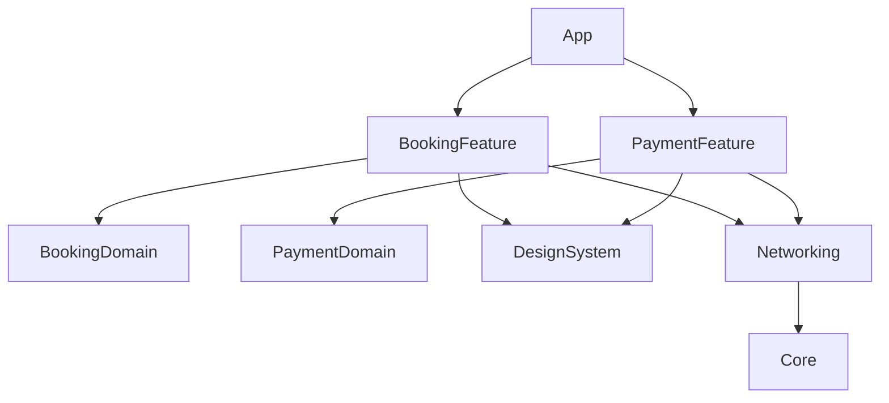

# Модульность без театра

> **Коротко:** Модульность нужна не для красивой схемы пакетов. Она нужна, чтобы команды могли менять фичи без случайных зависимостей, долгой сборки и страха задеть половину приложения.

## Где это всплывает в работе
На большом iOS-проекте модульность часто превращается в театр: много таргетов, сложный граф, но границы все равно текут. Настоящая модульность видна не по количеству модулей, а по тому, можно ли удалить, заменить, протестировать или собрать фичу отдельно.

## Рабочая модель
Хорошая граница модуля отвечает:

- что модуль экспортирует наружу;
- какие детали скрывает;
- кто владеет доменными моделями;
- где живут дизайн-системные компоненты;
- как фича получает зависимости;
- можно ли собрать preview/demo без всего приложения.



## Живой сценарий
Команда оплаты меняет экран подтверждения. Если модульность слабая, она тянет `AppCoordinator`, общий singleton, конкретный networking client и модель бронирования из другой фичи. Через неделю «маленькая правка оплаты» ломает deeplink бронирования.

Если границы нормальные, `PaymentFeature` получает `PaymentService` и `PaymentRouter` как контракты, а приложение решает, какие реализации подставить.

## Сложный кейс в коде

```swift
public protocol PaymentServicing {
    func loadPayment(id: String) async throws -> PaymentDetails
    func confirmPayment(id: String) async throws -> PaymentResult
}

public protocol PaymentRouting {
    func closePayment()
    func openReceipt(id: String)
    func openSupport(threadID: String)
}

public struct PaymentFeatureDependencies {
    let service: PaymentServicing
    let router: PaymentRouting

    public init(service: PaymentServicing, router: PaymentRouting) {
        self.service = service
        self.router = router
    }
}

public struct PaymentFeatureView: View {
    @StateObject private var viewModel: PaymentViewModel

    public init(id: String, dependencies: PaymentFeatureDependencies) {
        _viewModel = StateObject(wrappedValue: PaymentViewModel(
            id: id,
            service: dependencies.service,
            router: dependencies.router
        ))
    }

    public var body: some View {
        PaymentContentView(viewModel: viewModel)
    }
}
```

Фича не знает про `AppCoordinator`, `URLSession`, глобальный контейнер и соседние экраны. Это не академизм. Это возможность открыть `PaymentFeature` в preview, тесте или demo app без всей махины приложения.

## Редкие поломки
- Модули есть, но все импортируют `Core`, где лежит половина приложения.
- Shared-модель стала свалкой: ее боятся менять, потому что она «общая».
- Фича импортирует соседнюю фичу ради одного enum.
- Дизайн-система зависит от фичи, и граф зависимостей переворачивается.
- DI-контейнер стал скрытым глобальным singleton.
- Build time вырос из-за слишком мелкой нарезки модулей.
- Public API модуля раскрывает внутренние типы, и граница становится фикцией.

## Самопроверка
- Можно ли собрать фичу отдельно?  
  Ответ: если фиче нужен весь app target, граница слабая. Нормальная фича собирается с fake dependencies.
- Public API модуля маленький?  
  Ответ: наружу должны торчать entry point, контракты и минимум моделей. Все остальное должно быть internal.
- Есть ли импорт соседней фичи?  
  Ответ: почти всегда это запах. Лучше вынести маленький contract/domain type выше или передать зависимость через protocol.
- Core не превратился в мусорный ящик?  
  Ответ: если в Core лежат UI helpers, network DTO, date formatters и бизнес enum, он уже стал свалкой.
- Дизайн-система знает о продуктовых фичах?  
  Ответ: не должна. Она может знать роли и компоненты, но не booking/payment/profile.
- Можно ли заменить networking в тесте без запуска приложения?  
  Ответ: да, если фича получает service contract, а не тянет глобальный client напрямую.

Связано: [SPM и модули](<SPM и модули.md>), [Architecture review + refactor plan](<Architecture review + refactor plan.md>), [Design System для iOS продукта](<../01 SwiftUI и UI/Design System для iOS продукта.md>)
