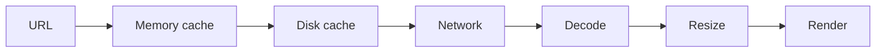

# Image loading и память

> **Коротко:** Картинки редко выглядят как архитектурная проблема, пока список не начинает лагать, память не растет, а старые изображения не появляются в переиспользованных ячейках.

## Рабочая модель
Загрузка изображения — это цепочка:



Дорогие места обычно не в самой сети, а в decode/resize на main thread, неконтролируемом memory cache и отсутствии отмены при переиспользовании.

## Где это ломается
Каталог отелей со 100 карточками. Пользователь быстро скроллит. Старые запросы продолжают грузить изображения, decoded bitmaps растут в памяти, а ячейка иногда показывает картинку предыдущего отеля.

## Разбор в коде

```swift
actor ImageMemoryCache {
    private var storage: [URL: UIImage] = [:]
    private var order: [URL] = []
    private let limit = 80

    func image(for url: URL) -> UIImage? {
        storage[url]
    }

    func insert(_ image: UIImage, for url: URL) {
        if storage[url] == nil {
            order.append(url)
        }

        storage[url] = image

        while order.count > limit {
            let oldest = order.removeFirst()
            storage[oldest] = nil
        }
    }
}

final class ImageLoader {
    private let cache: ImageMemoryCache
    private let session: URLSession

    init(cache: ImageMemoryCache, session: URLSession = .shared) {
        self.cache = cache
        self.session = session
    }

    func load(_ url: URL) async throws -> UIImage {
        if let cached = await cache.image(for: url) {
            return cached
        }

        let (data, _) = try await session.data(from: url)
        try Task.checkCancellation()

        guard let image = UIImage(data: data) else {
            throw ImageLoadingError.decoding
        }

        await cache.insert(image, for: url)
        return image
    }
}

enum ImageLoadingError: Error {
    case decoding
}
```

Для серьезного списка сюда еще просится downsampling под размер ячейки. Хранить оригинальные 3000px картинки ради карточки 120px — быстрый путь к memory pressure.

## Редкие поломки
- Картинка старого URL появляется в переиспользованной ячейке.
- Loader не отменяется при уходе карточки с экрана.
- Memory cache без лимита переживает длинный скролл.
- Disk cache хранит устаревшие аватарки без versioned URL.
- Изображение декодируется на main thread.
- Animated image съедает память сильнее, чем ожидали.
- Placeholder и error image имеют разные размеры и дергают layout.

## Самопроверка
- Отменяется ли загрузка при исчезновении ячейки?  
  Ответ: должна. Иначе быстрый скролл продолжает делать работу для невидимого UI.
- Есть ли лимит memory cache?  
  Ответ: обязательно. Без лимита список может убить приложение без единого crash в коде.
- Resize/downsample делается под размер отображения?  
  Ответ: для больших картинок да, иначе память тратится на пиксели, которые не видны.
- URL версии учитывает обновление картинки?  
  Ответ: если avatar URL не меняется, нужен cache invalidation или version query.
- Placeholder не ломает layout?  
  Ответ: размеры placeholder, success и error должны быть стабильны.

## Практика на вечер
Открой экран со списком картинок и замерь memory после 30 секунд быстрого скролла. Потом проверь, сколько задач остается активными после ухода со страницы.

Связано: [Performance budgets и Instruments](<Performance budgets и Instruments.md>), [SwiftUI state identity effects](<../01 SwiftUI и UI/SwiftUI state identity effects.md>), [Networking слой без сюрпризов](<../02 Сеть и данные/Networking слой без сюрпризов.md>), [Instruments](<Instruments.md>)
