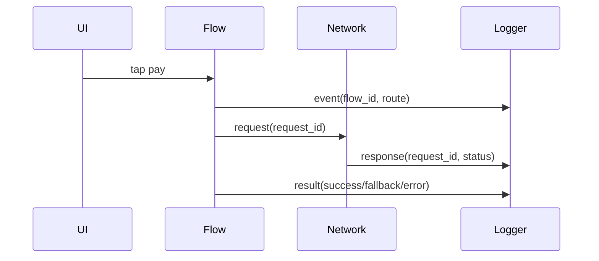

# Observability для iOS

> **Коротко:** Observability нужна не для красивых логов. Она нужна, чтобы после продовой жалобы понять: что сделал пользователь, какой запрос ушел, какой route открылся, где сломалось и можно ли это повторить.

## Где это всплывает в работе
Когда приложение уже в руках пользователей, «у меня не воспроизводится» перестает быть ответом. Нужна система следов: события, ошибки, breadcrumbs, request id, session id, версия приложения, состояние фичи.

Но есть граница: наблюдаемость не должна превращаться в слежку и слив персональных данных.

## Рабочая модель
Хорошая observability отвечает на вопросы:

- кто: версия приложения, платформа, feature flags, не персональные данные;
- где: экран, route, flow id;
- что: действие пользователя, сетевой запрос, доменная ошибка;
- когда: порядок событий;
- почему: error model, status code, cancellation, timeout;
- чем закончилось: fallback, retry, success, abandoned.



## Живой сценарий
Пользователь пишет: «Оплата не открылась после пуша». Без observability у тебя только догадки. С нормальными следами видно:

- push tap был;
- route распарсился в `payment(bookingID)`;
- session восстановилась;
- resolver получил 403;
- UI показал fallback, но текст был слишком общий;
- request id связан с backend-логом.

Это уже не «магия не сработала», а конкретная цепочка.

## Сложный кейс в коде

```swift
struct FlowContext: Sendable {
    let flowID: UUID
    let screen: String
    let route: String?
}

protocol AppLogger {
    func event(_ name: String, context: FlowContext, metadata: [String: String])
    func error(_ error: Error, context: FlowContext, metadata: [String: String])
}

struct RedactingLogger: AppLogger {
    private let sink: LogSink

    func event(_ name: String, context: FlowContext, metadata: [String: String]) {
        sink.send(name: name, context: context, metadata: redact(metadata))
    }

    func error(_ error: Error, context: FlowContext, metadata: [String: String]) {
        sink.send(name: "error", context: context, metadata: redact(metadata).merging([
            "error_type": String(describing: type(of: error))
        ], uniquingKeysWith: { current, _ in current }))
    }

    private func redact(_ metadata: [String: String]) -> [String: String] {
        metadata.filter { key, _ in
            !["email", "phone", "token", "full_name"].contains(key.lowercased())
        }
    }
}
```

Логгер здесь специально не принимает любые объекты. Чем свободнее API логирования, тем быстрее в него утекут токены, email, телефоны и куски payload.

## Редкие поломки
- Логи есть, но в них нет flow id. Нельзя собрать цепочку.
- Crash report есть, но breadcrumbs слишком шумные и не показывают главный путь.
- В лог попал access token или персональные данные.
- Cancellation залогировали как ошибку, и алерты шумят.
- Offline-сценарий не логируется, потому что «запроса же не было».
- Разные команды называют одно событие по-разному.
- Логи завязаны на текст ошибки, который меняется при локализации.

## Самопроверка
- Можно ли по одной жалобе собрать путь пользователя?  
  Ответ: да, если есть flow id, route, ключевые breadcrumbs и итог сценария.
- Есть ли request id/flow id?  
  Ответ: request id нужен для сети, flow id — для пользовательского сценария. Обычно нужны оба.
- Какие поля запрещено логировать?  
  Ответ: токены, email, телефон, ФИО, raw payload с персональными данными, платежные детали.
- Cancellation отделена от failure?  
  Ответ: должна быть. Отмена при уходе со страницы не должна попадать в error-alert и портить статистику.
- Ошибки доменные или просто `localizedDescription`?  
  Ответ: для анализа нужна доменная причина: timeout, forbidden, staleObject, decoding, cancelled.
- Можно ли связать мобильный лог с backend-логом?  
  Ответ: да, если request id/trace id проходит через headers и попадает в обе стороны.

## Практика на вечер
Выбери один flow: push -> payment screen. Добавь:

- flow id;
- route parsed event;
- auth restored event;
- network request id;
- resolver result;
- fallback shown event;
- redaction-тест, который доказывает, что email/token не уходят в лог.

Мини-челлендж: сделай словарь event names и запрети свободные строки на уровне API.

Связано: [Observability](<Observability.md>), [Push Notifications в продакшене](<../03 Push Deep Links и флаги/Push Notifications в продакшене.md>), [Networking слой без сюрпризов](<../02 Сеть и данные/Networking слой без сюрпризов.md>), [Security (practical)](<../07 Безопасность/Security practical.md>)
