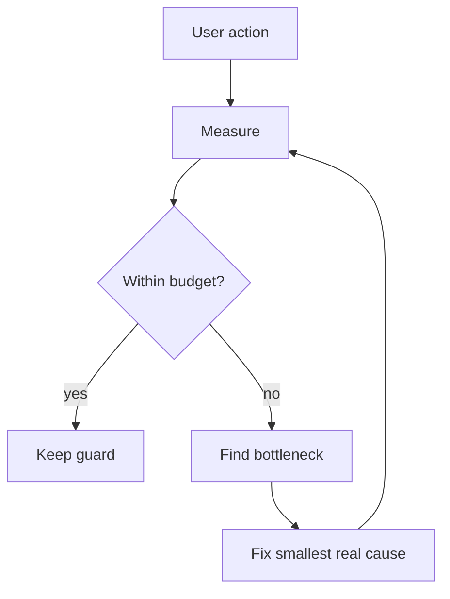

# Performance budgets и Instruments

> **Коротко:** Производительность нельзя чинить ощущениями. Нужны бюджеты: сколько экран может стартовать, сколько весит первый рендер, где main thread занят, сколько памяти съедает список.

## Где это всплывает в работе
Instruments полезен не только после жалобы. Заранее стоит понимать, какие сценарии дорогие: первый запуск, скролл длинного списка, декодинг больших ответов, SwiftUI diffing, изображения, cold start после пуша.

Performance — это продуктовая характеристика. Медленный экран доверия не вызывает, даже если код архитектурно чистый.

## Рабочая модель
Performance budget — это конкретная граница, которую команда согласна защищать. Например:

- cold start до первого полезного экрана;
- время до content после tap;
- main thread blocking;
- память на тяжелом списке;
- размер image cache;
- количество повторных body-render для одного действия.



## Живой сценарий
Экран каталога отелей тормозит при скролле. Команда спорит: «SwiftUI тяжелый», «картинки большие», «backend много прислал». Без замера это разговоры. С замером видно:

- main thread занят resize изображений;
- список пересчитывает body из-за нестабильной модели;
- JSON decode идет на main actor;
- cache не ограничен и давит память.

## Сложный кейс в коде
Самый простой performance-выигрыш часто не в магии, а в запрете тяжелой работы на main actor.

```swift
struct HotelDTO: Decodable {
    let id: String
    let title: String
    let imageURL: URL
}

struct HotelCard: Identifiable, Equatable {
    let id: String
    let title: String
    let imageURL: URL
}

actor HotelMapper {
    func map(_ data: Data) throws -> [HotelCard] {
        let dto = try JSONDecoder().decode([HotelDTO].self, from: data)
        return dto.map { HotelCard(id: $0.id, title: $0.title, imageURL: $0.imageURL) }
    }
}

@MainActor
final class CatalogViewModel: ObservableObject {
    @Published private(set) var cards: [HotelCard] = []

    private let api: CatalogAPI
    private let mapper: HotelMapper

    init(api: CatalogAPI, mapper: HotelMapper) {
        self.api = api
        self.mapper = mapper
    }

    func load() {
        Task {
            let data = try await api.loadCatalogData()
            let mapped = try await mapper.map(data)
            cards = mapped
        }
    }
}
```

Это не значит, что каждый mapper должен быть actor. Смысл в другом: тяжелая работа не должна случайно оказаться на main actor только потому, что ViewModel там живет.

## Редкие поломки
- Оптимизировали скролл на iPhone Pro, но старое устройство все равно падает по памяти.
- `Equatable` у модели сравнивает слишком много и сам становится дорогим.
- Lazy image loading решает сеть, но не решает decode/resize.
- `@MainActor` на весь сервис случайно переносит тяжелую работу в главный поток.
- Instruments показывает симптом, но не причину: высокий CPU может быть из-за логов.
- Snapshot-тесты не ловят performance regression.
- SwiftUI preview быстрый, а реальный экран медленный из-за данных и lifecycle.

## Самопроверка
- Есть ли конкретный performance budget?  
  Ответ: нужен хотя бы рабочий ориентир: time to first content, frame drops, memory peak, cold start.
- Чем подтверждено, что проблема именно здесь?  
  Ответ: Instruments, signpost, метрика до/после. «На глаз стало быстрее» не считается доказательством.
- Main thread свободен во время decode/map/resize?  
  Ответ: тяжелый decode, mapping и image resize не должны случайно оказаться на `MainActor`.
- Проверяли ли старое устройство или только симулятор?  
  Ответ: симулятор полезен для поиска, но performance-вывод без старого реального устройства слабый.
- После фикса есть guard?  
  Ответ: хотя бы signpost, perf smoke, snapshot сценария или зафиксированная метрика в release checklist.
- Оптимизация не ухудшила читаемость без причины?  
  Ответ: если код стал сложнее, выигрыш должен быть измерен. Иначе это технический долг под видом скорости.

## Практика на вечер
Возьми экран со списком и замерь:

- time to first content;
- main thread stalls;
- memory после 3 минут скролла;
- количество сетевых загрузок изображений;
- повторные body-render при одном tap.

Мини-челлендж: добавь signpost вокруг загрузки и маппинга, чтобы видеть путь от tap до content в Instruments.

Связано: [Instruments](<Instruments.md>), [SwiftUI state identity effects](<../01 SwiftUI и UI/SwiftUI state identity effects.md>), [Networking слой без сюрпризов](<../02 Сеть и данные/Networking слой без сюрпризов.md>), [Observability](<Observability.md>)
