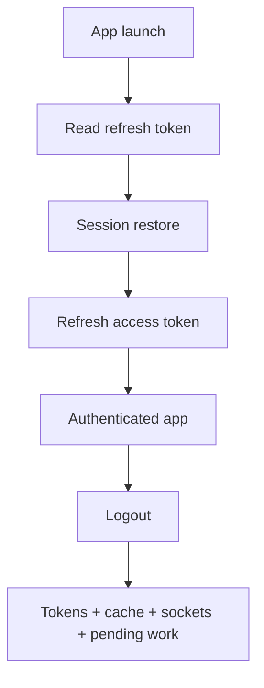

# Security Session Keychain

> **Коротко:** Сессия — это не только access token. Это граница пользователя, keychain, logout, refresh, device state, биометрия и запрет старым задачам писать в новый аккаунт.

## Рабочая модель
В iOS auth часто выглядит проще, чем есть:

- access token живет недолго;
- refresh token лежит в Keychain;
- app может быть восстановлен из background;
- logout должен чистить не только token, но и кеш/очереди/сокеты;
- биометрия защищает локальный доступ, но не заменяет серверную авторизацию.



## Где это ломается
Пользователь вышел из аккаунта и сразу вошел другим. Старый запрос профиля завершился позже и записал имя прошлого пользователя в новый state. Keychain был очищен, но async-задача и кеш жили своей жизнью.

Logout должен быть не кнопкой, а событием, которое отменяет старый мир.

## Разбор в коде

```swift
struct Session: Equatable, Sendable {
    let id: UUID
    let userID: String
    let accessToken: String
}

@MainActor
final class SessionStore: ObservableObject {
    @Published private(set) var session: Session?

    private let keychain: TokenStorage
    private let cleanup: SessionCleanup

    init(keychain: TokenStorage, cleanup: SessionCleanup) {
        self.keychain = keychain
        self.cleanup = cleanup
    }

    func restore() async {
        guard let token = try? await keychain.readRefreshToken() else {
            session = nil
            return
        }

        // Здесь обычно идет refresh access token.
        session = Session(id: UUID(), userID: token.userID, accessToken: token.accessToken)
    }

    func logout() async {
        let oldSessionID = session?.id
        session = nil
        try? await keychain.clear()
        await cleanup.cleanAfterLogout(oldSessionID: oldSessionID)
    }
}

actor SessionCleanup {
    func cleanAfterLogout(oldSessionID: UUID?) async {
        // Закрыть sockets, очистить account-bound cache, pending mutations и route queue.
    }
}
```

Сильная деталь — `session.id`. Это не просто user id. Это конкретная жизнь конкретной авторизации. После logout/login тот же user может получить новый session id, и старые async-ответы не должны иметь право писать в state.

## Редкие поломки
- Refresh token удалили, но WebSocket старой сессии остался открыт.
- Pending offline mutations replay-нулись после logout.
- Keychain item доступен после восстановления backup на другом устройстве не так, как ожидали.
- Face ID включили как «логин», хотя backend-сессия уже протухла.
- Access token попал в logs через debug metadata.
- 401 storm запустил несколько refresh одновременно.

## Самопроверка
- Logout чистит только token или весь session-bound мир?  
  Ответ: должен чистить sockets, кеш аккаунта, pending routes, pending mutations и in-flight tasks.
- Есть ли session id guard после `await`?  
  Ответ: нужен в местах, где старый ответ может записать данные после смены аккаунта.
- Keychain accessibility выбран осознанно?  
  Ответ: да, нужно понимать, доступен ли token после reboot, backup, lock state.
- Биометрия не подменяет auth?  
  Ответ: она может защищать локальный вход, но серверный доступ все равно решает token/session.
- Sensitive данные не логируются?  
  Ответ: токены, refresh payload и user PII не должны попадать в breadcrumbs.

## Практика на вечер
Пройди сценарий: login -> открыть экран -> запустить запрос -> logout -> login другим пользователем -> завершить старый запрос. Если старый ответ может изменить новый UI, сессия защищена плохо.

Связано: [Security (practical)](<Security practical.md>), [Networking слой без сюрпризов](<../02 Сеть и данные/Networking слой без сюрпризов.md>), [Structured Concurrency под нагрузкой](<../08 Concurrency/Structured Concurrency под нагрузкой.md>), [Offline-first и консистентность данных](<../02 Сеть и данные/Offline-first и консистентность данных.md>)
