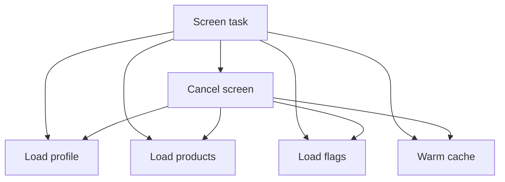

# Structured Concurrency под нагрузкой

> **Коротко:** Structured Concurrency хороша не тем, что код стал короче. Она хороша тем, что у асинхронной работы появляется владелец, границы, отмена и понятный момент завершения.

## Где это всплывает в работе
В реальном проекте async-код редко состоит из одного запроса. Обычно экран одновременно грузит профиль, тарифы, флаги, кеш, аналитику и живые обновления. Если это собрано через случайные `Task {}` в разных местах, код будет работать до первого сложного сценария: logout, смена аккаунта, плохая сеть, быстрый уход со страницы.

## Рабочая модель
Structured Concurrency отвечает на простой вопрос: кто отвечает за эту работу?

- `async let` хорош для небольшого фиксированного набора параллельных операций.
- `TaskGroup` хорош, когда набор динамический или нужно собрать много независимых результатов.
- `Task {}` нужен осторожно: он часто рвет дерево задач.
- `Task.detached` почти всегда требует отдельного объяснения в review.
- `Actor` защищает состояние, но не отменяет архитектурные решения за тебя.



## Живой сценарий
Главный экран банка или travel-приложения. Нужно загрузить:

- профиль пользователя;
- баланс или бронирования;
- персональные предложения;
- feature flags;
- локальный кеш для мгновенного первого рендера.

Если пользователь ушел со страницы или вышел из аккаунта, вся работа должна остановиться. Не «почти вся», а вся цепочка, включая парсинг и запись в кеш.

## Сложный кейс в коде
Пример: один родительский сценарий, параллельные операции и явная отмена.

```swift
struct HomeBootstrap {
    let profile: Profile
    let bookings: [Booking]
    let flags: FeatureFlags
}

protocol HomeAPI {
    func loadProfile() async throws -> Profile
    func loadBookings() async throws -> [Booking]
    func loadFeatureFlags() async throws -> FeatureFlags
}

@MainActor
final class HomeViewModel: ObservableObject {
    enum State {
        case idle
        case loading
        case content(HomeBootstrap)
        case error(String)
    }

    @Published private(set) var state: State = .idle

    private let api: HomeAPI
    private var loadTask: Task<Void, Never>?

    init(api: HomeAPI) {
        self.api = api
    }

    func load() {
        loadTask?.cancel()
        state = .loading

        loadTask = Task { [api] in
            do {
                async let profile = api.loadProfile()
                async let bookings = api.loadBookings()
                async let flags = api.loadFeatureFlags()

                let bootstrap = try await HomeBootstrap(
                    profile: profile,
                    bookings: bookings,
                    flags: flags
                )

                try Task.checkCancellation()
                state = .content(bootstrap)
            } catch is CancellationError {
                return
            } catch {
                state = .error("Не удалось обновить главный экран")
            }
        }
    }

    func cancel() {
        loadTask?.cancel()
        loadTask = nil
    }
}
```

Теперь усложнение: запись в кеш должна быть за actor, а не за случайный background queue.

```swift
actor HomeCache {
    private var lastBootstrap: HomeBootstrap?

    func save(_ bootstrap: HomeBootstrap) {
        lastBootstrap = bootstrap
    }

    func load() -> HomeBootstrap? {
        lastBootstrap
    }
}
```

Важно: actor сериализует доступ, но не делает состояние автоматически правильным. Если туда записать устаревший bootstrap после смены аккаунта, actor честно сохранит неправильные данные. Нужен session id, request id или другой доменный guard.

## Редкие поломки
- `Task {}` внутри сервиса переживает родительский task, потому что уже не является дочерней задачей.
- Отмена поймана сверху, но нижний слой все равно пишет в кеш.
- Actor reentrancy: метод actor сделал `await`, после чего состояние могло измениться другим вызовом.
- `MainActor` используется как способ «починить гонку», хотя проблема в границах состояния.
- Приоритеты задач не спасают от плохой архитектуры. Low priority задача все равно может записать поздний результат.
- `Task.detached` потерял task-local context: trace id, session id, user id.

## Самопроверка
- Кто владелец этой задачи?  
  Ответ: экран, session, repository или app-level service. Если владелец не назван, задача легко переживет свой сценарий.
- Если владелец исчез, все дочерние операции отменятся?  
  Ответ: только если работа остается в structured tree. Случайный `Task {}` внутри сервиса уже живет отдельно.
- Есть ли запись в состояние после `await`, которую надо защитить актуальностью?  
  Ответ: да, почти всегда. После `await` мир мог измениться: query, session, экран, selected id.
- Не спрятан ли unstructured `Task {}` внутри слоя ниже?  
  Ответ: это проверяется поиском и review. Внутренний fire-and-forget должен иметь очень явную причину.
- Actor защищает данные или просто прячет проблему?  
  Ответ: actor сериализует доступ, но не решает доменную актуальность. Старые данные он сохранит так же аккуратно, как новые.

Связано: [Swift Concurrency (advanced)](<Swift Concurrency advanced.md>), [Actors и Sendable](<Actors и Sendable.md>), [SwiftUI state identity effects](<../01 SwiftUI и UI/SwiftUI state identity effects.md>), [Networking слой без сюрпризов](<../02 Сеть и данные/Networking слой без сюрпризов.md>)
