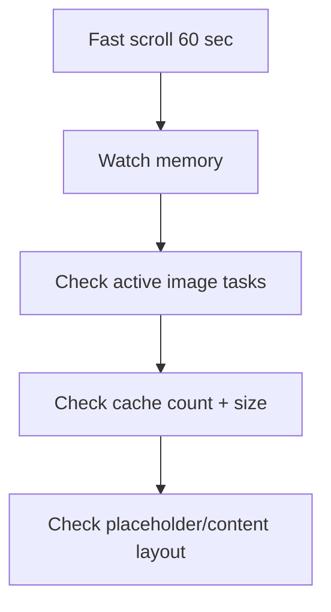

# Image loader съел память на списке

> **Коротко:** Большой список с картинками может убить память без единой явной ошибки в бизнес-коде.

## Ситуация
Каталог отелей начинал лагать после минуты скролла. Crash был редкий, но память росла стабильно.

Причина: loader кешировал decoded `UIImage` без лимита и показывал оригинальные большие изображения в маленьких карточках.

## Что насторожило
- Memory cache без лимита.
- Нет downsampling под размер карточки.
- Загрузка не отменяется при исчезновении ячейки.
- Placeholder и loaded image имеют разный aspect ratio.

## Быстрая проверка

## Вывод
Image loading — это не просто сеть. Это decode, resize, cache policy, cancellation и стабильный layout.

Связано: [Image loading и память](<../06 Производительность и наблюдаемость/Image loading и память.md>), [Performance budgets и Instruments](<../06 Производительность и наблюдаемость/Performance budgets и Instruments.md>), [Instruments](<../06 Производительность и наблюдаемость/Instruments.md>)
