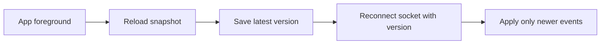

# WebSocket зеленый но данные старые

> **Коротко:** `connected` не значит, что экран показывает свежие данные.

## Ситуация
Экран заказа показывал зеленый индикатор "online". Socket был открыт. Но статус заказа отставал: приложение ушло в background, пропустило событие, вернулось и продолжило слушать поток без сверки snapshot.

Пользователь видел «курьер назначен», хотя заказ уже был доставлен.

## Что насторожило
- UI доверял факту соединения.
- После foreground не было запроса актуального snapshot.
- События не имели версии.
- Store не умел отбросить старое событие.

## Нормальная модель

## Правило
Socket — это канал. Свежесть — это доменное свойство. Их нельзя смешивать.

Связано: [WebSocket в продакшене](<../02 Сеть и данные/WebSocket в продакшене.md>), [Networking слой без сюрпризов](<../02 Сеть и данные/Networking слой без сюрпризов.md>), [Observability для iOS](<../06 Производительность и наблюдаемость/Observability для iOS.md>)
