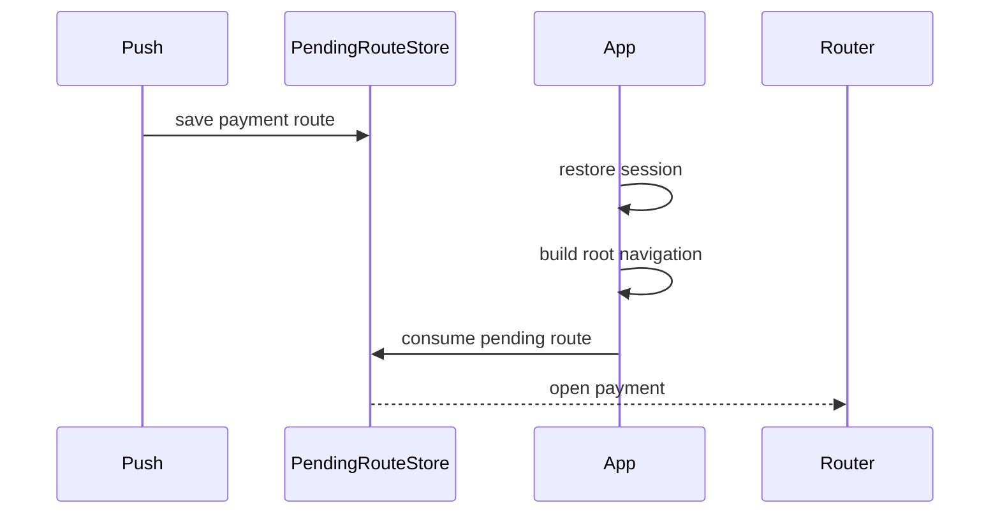

# Пуш открыл приложение раньше навигации

> **Коротко:** Tap по пушу может прийти раньше, чем приложение восстановило сессию и собрало root navigation.

## Ситуация
Пуш про оплату. Пользователь тапнул из killed state. Delegate получил payload, route распарсился, но экран оплаты не открылся. В логах tap есть, crash нет, route как будто «пропал».

Проблема была не в push payload. Route пытались открыть слишком рано.

## Что насторожило
- `didReceive response` сразу дергал navigator.
- Не было pending route.
- Auth restore шел параллельно и заканчивался позже.
- Fallback не логировался.

## Как бы я делал

## Мини-правило
Delegate не должен быть навигатором. Он должен превратить внешний сигнал в намерение: `PushRoute.payment(id)`. Открытие экрана начинается только после готовности приложения.

## Проверка
- killed state;
- background state;
- foreground state;
- logout между tap и открытием route;
- feature flag выключил экран оплаты.

Связано: [Push Notifications в продакшене](<../03 Push Deep Links и флаги/Push Notifications в продакшене.md>), [App Lifecycle Deep Links Navigation](<../03 Push Deep Links и флаги/App Lifecycle Deep Links Navigation.md>), [Feature Flags и Remote Config](<../03 Push Deep Links и флаги/Feature Flags и Remote Config.md>)
